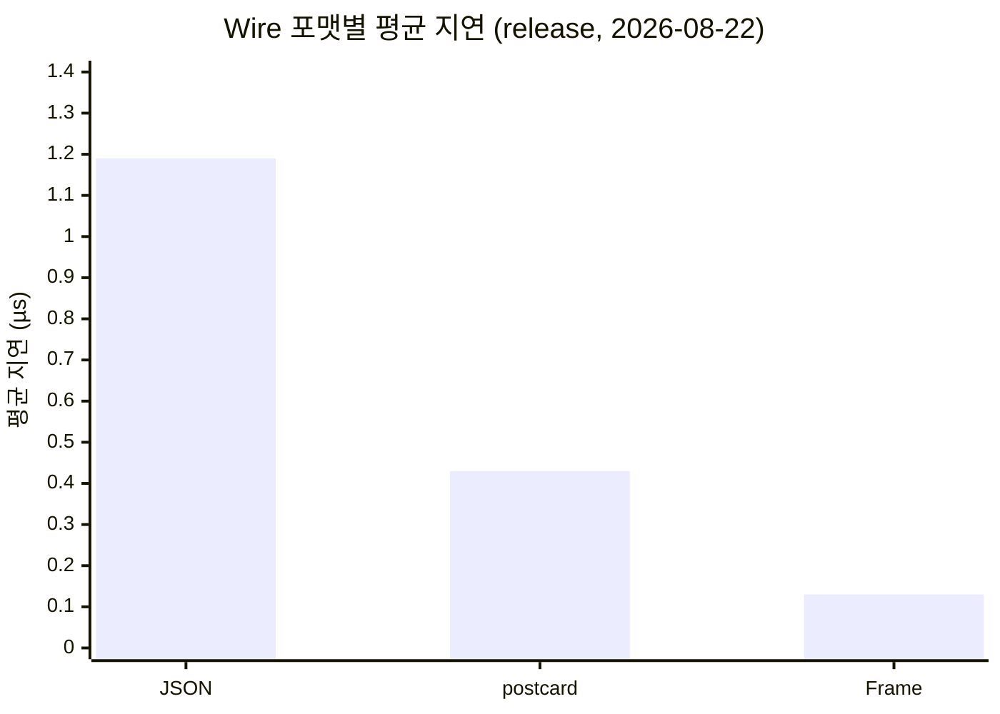
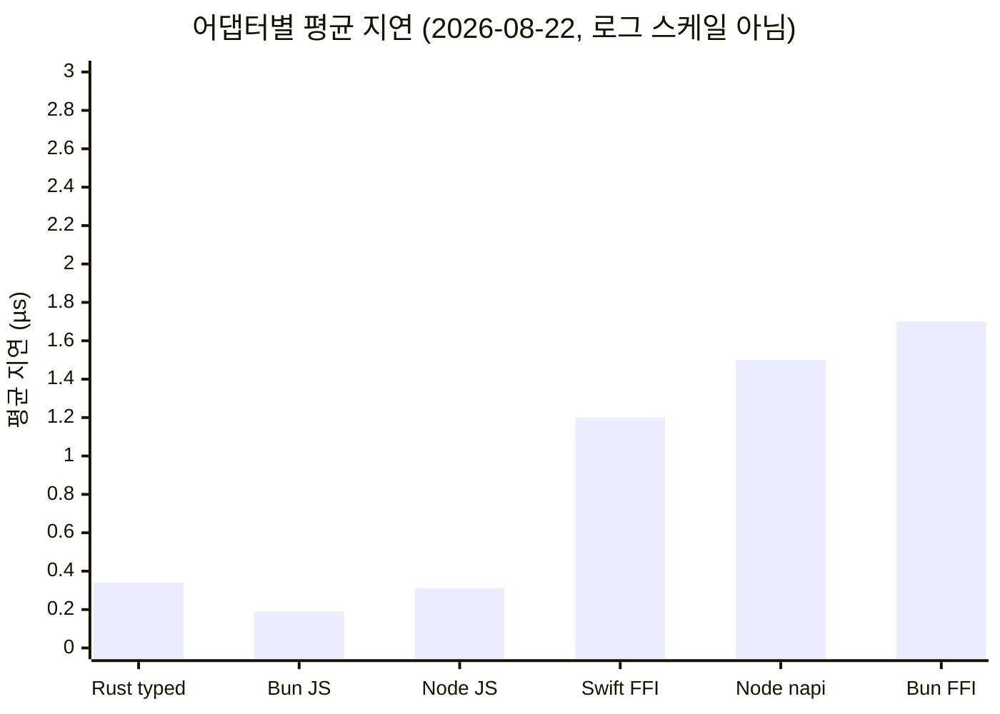

[English](./benchmarks.md)

# 벤치마크

모든 측정은 Apple Silicon (M-series) 환경에서 수행했다. 달리 표기하지 않은
수치는 각 표에 적힌 날짜의 영수증이다. Bun FFI는 2026-08-23 Bun 1.4.0에서
다시 측정했고, React Native headline은 같은 날짜의 이전 Release 실행 기록이다.
측정 코드가 바뀐 뒤에는 과거 숫자를 현재 checkout의 실행 증거로 간주하지 않는다.

## 테스트 환경

| 항목           | 버전                         |
| -------------- | ---------------------------- |
| OS             | macOS (Darwin 25.3.0, arm64) |
| Rust           | stable, aarch64-apple-darwin |
| Node.js        | v22.21.1                     |
| Bun            | 1.4.0                        |
| React Native   | 0.81.5 + Expo 54             |
| iOS 시뮬레이터 | iPhone 17                    |

## 0.10.2 코어 성능 패치 (2026-09-16)

발행된 0.10.1 (`1f277de2`)과 비교해 재귀 codec, optional 필드 복사, 넓은
struct 탐색 비용을 줄였다. Weak 역참조, 공개 API, wire 형식과 Linux Alpha는 유지한다.

동일한 Apple M1 Max, macOS 26.6.2, Rust 1.98.0, Criterion 0.8.2, 최적화 bench
프로필에서 동일 fixture를 사용했다. 기준판·후보판을 독립 프로세스 각 5회씩
AB/BA 교차 실행했다. case마다 0.5초 워밍업, 2초 측정, 500 sample이며 아래 값은
실행별 Criterion median 다섯 개의 중앙값이다. 지연은 낮을수록 좋다. 할당 횟수는
별도 계측 바이너리에서 case마다 100회 워밍업 후 1,000회 호출해 측정했다.

| Case                      | 0.10.1 (ns) | 0.10.2 (ns) |  Change | Allocation calls |
| ------------------------- | ----------: | ----------: | ------: | ---------------: |
| `map_keys_2`              |      641.11 |      664.07 |  +3.58% |          13 → 13 |
| `map_keys_64`             |   17,179.27 |   18,251.27 |  +6.24% |        279 → 280 |
| `map_of_seqs`             |      411.34 |      430.91 |  +4.76% |            8 → 8 |
| `map_seq_1024`            |   19,456.82 |   20,120.59 |  +3.41% |          25 → 17 |
| `oneof_data_enum`         |      152.49 |      167.12 |  +9.60% |            2 → 2 |
| `optional_chunks_near_1m` |  131,935.47 |  105,729.69 | -19.86% |          28 → 24 |
| `optional_none`           |      178.06 |      155.96 | -12.41% |            3 → 2 |
| `optional_string_64`      |      333.86 |      258.49 | -22.58% |            6 → 4 |
| `optional_string_64k`     |   13,453.30 |    6,678.66 | -50.36% |            6 → 4 |
| `recursive_depth_1`       |      844.28 |      181.05 | -78.56% |           16 → 2 |
| `recursive_depth_16`      |    8,816.80 |    1,934.79 | -78.06% |         154 → 20 |
| `recursive_depth_8`       |    4,455.16 |      950.55 | -78.66% |          81 → 11 |
| `scalar_control`          |       52.74 |       54.26 |  +2.88% |            1 → 1 |
| `wide_struct_32`          |    3,622.29 |    1,464.85 | -59.56% |            5 → 5 |

재귀 깊이 8은 4.455 µs에서 0.951 µs로 78.66% 줄었고, 호출당 할당은 81회에서
11회로 줄었다. 64 KiB optional 문자열은 지연이 절반으로 줄며 요청한 할당 바이트는
262,184에서 196,636으로 줄었다. 약 1 MiB case는 기존 문자열·컬렉션 한도를
유지하도록 16개 chunk를 사용하며 할당 요청량은 5,177,667에서 4,128,933바이트로
줄었다. 이 값은 현재 살아 있는 메모리나 RSS가 아닌 할당 요청량이다.

모든 경로가 빨라진 것은 아니다. oneOf는 9.60%, 64개 키 map은 6.24% 느려졌고
map 할당이 1회 늘었다. 나머지 대조군은 2.88–4.76% 느려졌다. 반복 중앙값은 모두
사전에 정한 10% 회귀 예산 안이다. oneOf는 경계에 가까우므로 이후에도 대조군으로
유지한다. flatten, 중첩 nullable, 타입이 있는 map 키, const 스키마는 기존 Value
codec으로 호환성을 유지한다. direct 실패 후 fallback하는 타입은 작업이 추가될 수
있지만 명령 핸들러는 재실행하지 않는다.

[전체 영수증](benchmark-receipts/2026-09-16-patch-performance-ab.json)에 10개 실행,
원시 추정값, 요청 크기, 할당 횟수, 환경과 소스·벤치·바이너리 hash가 있다. 후보는
커밋 전에 측정했으므로 base HEAD가 최종 소스를 뜻하지 않으며 파일별 hash로 식별한다.
[중단된 진단 기록](benchmark-receipts/2026-09-16-patch-performance-diagnostic.json)은
회귀 때문에 채택하지 않은 이전 구현의 기록이며 최종 수용 근거에 포함하지 않는다.

재현하려면 0.10.1과 이 패치를 별도 checkout하고 후보의 `complex_route.rs`,
`benches/support/complex_cases.rs`, `benches/common.rs`, `examples/codec_allocations.rs`를
기준판에도 복사한다. 각각 `cargo bench -p rustra --bench complex_route --no-run --locked`와
`cargo build -p rustra --example codec_allocations --release --locked`로 빌드한다.
`python3 scripts/benchmark-complex-ab.py --help`에 따라 두 checkout 경로, Criterion 및
할당 계측 실행 파일, 새 artifact 디렉터리, 결과 JSON 경로를 지정한다. 측정 중에는
대상 소스를 수정하거나 다시 빌드하지 않는다.

측정 대상은 `Package::invoke_frame`이다. 앱 p95, JS transport, WebView/JSI,
실기기, CPU·에너지 개선을 뜻하지 않는다. [SPEC](specs/2026-09-16-patch-performance.md)과
[검증 기록](verification/2026-09-16-patch-performance.md)에 범위를 명시했다.

### 분기 트리와 탐색

단일 연결 재귀 외에 각 노드가 ID, 문자열, enum, 정수 배열을 담은 map 2개 항목,
optional 문자열, 재귀 자식 배열을 가진 트리를 검사한다. optional 값이 있는 노드와
없는 노드를 모두 포함한다.

| Shape          | Nodes | Node levels | Max children | Echo input bytes |
| -------------- | ----: | ----------: | -----------: | ---------------: |
| `balanced31`   |    31 |           5 |            2 |            2,063 |
| `balanced255`  |   255 |           8 |            2 |           17,659 |
| `balanced1023` | 1,023 |          10 |            2 |           71,812 |
| `balanced8191` | 8,191 |          13 |            2 |          579,544 |
| `wide1025`     | 1,025 |           2 |        1,024 |           72,426 |
| `skew_limit`   |    15 |          15 |            1 |              999 |
| `payload255`   |   255 |           8 |            2 |          140,314 |

같은 전위 DFS로 마지막 노드를 찾고 전체 노드 방문을 사전 검증한 뒤 네 가지를 측정한다.

- `echo`: 입력 트리 전체를 복원하고 전체 트리를 반환한다.
- `search`: 입력 트리 전체를 복원하고 탐색한 뒤 결과만 반환한다.
- `resident`: 트리를 Rust에 보관하고 트리 번호와 찾을 ID만 보내 조회한다.
- `dfs`: 이미 메모리에 있는 트리에서 순수 탐색만 수행한다.

기존 complex suite와 같은 호스트·최적화 프로필에서 기준판·후보판 독립 프로세스를
각 5회 AB/BA 교차 실행했다. case마다 Criterion 100 sample, 워밍업 0.5초, 측정
2초이며 할당은 별도 실행에서 준비 20회·측정 100회다. 형상과 요청·응답 크기는
양쪽 버전 및 모든 반복에서 일치해야 한다. 아래 값은 실행별 median 다섯 개의
중앙값이며 p95가 아니다.

| Shape          | Echo 0.10.1 → 0.10.2 (µs) | Search 0.10.1 → 0.10.2 (µs) | Resident 0.10.2 (µs) | DFS 0.10.2 (µs) |
| -------------- | ------------------------: | --------------------------: | -------------------: | --------------: |
| `balanced31`   |             90.37 → 32.05 |               46.30 → 17.38 |                0.123 |           0.066 |
| `balanced255`  |           738.64 → 262.22 |             375.91 → 146.37 |                0.665 |           0.603 |
| `balanced1023` |       3,090.22 → 1,061.35 |           1,572.75 → 590.87 |                2.568 |           2.453 |
| `balanced8191` |      25,805.35 → 8,675.21 |        13,235.35 → 4,775.80 |               20.459 |          20.338 |
| `wide1025`     |       2,862.75 → 1,000.91 |           1,472.92 → 549.93 |                2.297 |           2.186 |
| `skew_limit`   |             44.75 → 15.94 |                23.14 → 8.82 |                0.090 |           0.030 |
| `payload255`   |           757.81 → 276.62 |             383.87 → 154.31 |                0.666 |           0.602 |

7개 형상의 전체 트리 왕복은 63.50–66.38%, 전체 입력을 보내는 검색은 59.80–63.92%
시간이 줄었다. 8,191노드 왕복은 25.805 ms → 8.675 ms, 전체 입력 검색은 13.235 ms →
4.776 ms다. resident 조회와 순수 DFS의 변화는 -1.59%에서 +2.12% 사이다. 탐색
알고리즘을 바꾸지 않았으므로 주된 개선 대상은 Rust 코어 경계에서 트리를 변환하고
전달하는 비용이다. JS와 Rust 사이 transport는 측정하지 않았다.

같은 트리를 보관하고 조회하는 후보의 시간은 20.459 µs다. 이는 앱에서 데이터 수명을
다르게 두는 패턴의 차이이며 0.10.2에서 탐색 알고리즘이 이만큼 빨라졌다는 뜻이 아니다.
resident 조회는 호출당 응답 할당 1회, 순수 DFS는 0회다. [전체 트리 영수증](benchmark-receipts/2026-09-16-tree-performance-ab.json)에
모든 반복과 할당 수가 있다. [중단 진단](benchmark-receipts/2026-09-16-tree-performance-diagnostic.json)은
검토에서 누락된 공통 helper hash를 추가하기 전 기록이며 최종 수용 근거가 아니다.
재현 시 양쪽 checkout에 같은 `tree_route.rs`, `support/tree_*.rs`, `common.rs`,
`tree_allocations.rs`를 놓고 `--bench tree_route`와 `--example tree_allocations --release`를
빌드한 뒤 A/B 스크립트에 `--suite tree`를 전달한다. Benchmark workflow에도 등록했다.
새 case의 첫 호스팅 실행은 기준선 생성이며, 버전 비교는 이 로컬 A/B에 근거한다.
Linux나 실기기 성능 수용을 뜻하지 않는다.

8,191노드 전체 입력 검색은 579,546바이트를 보내고 13바이트를 반환한다. 같은 resident
조회는 5바이트를 보내고 13바이트를 반환한다. 보관 준비·저장 비용은 측정 루프 밖이며
무료이거나 검증됐다는 뜻이 아니다. 기존 명령 closure와 공유 소유권으로 구성하고 새
런타임 API를 추가하지 않았다. resident와 순수 DFS는 같은 값을 가진 별도 트리여서
메모리 배치가 다르다. 두 시간을 빼서 정확한 호출 overhead로 해석하지 않는다.

측정 전에 깊이 1–40을 검사했다. 기본 codec 깊이 32에서 이 복합 노드는 트리 15단계까지
허용되고 16–40단계는 정확한 깊이 제한 오류로 거부된다. 배열·객체·enum도 codec 깊이를
소비하므로 트리의 업무상 단계와 codec 깊이는 다르다. 전체 노드 수와 깊이·payload 한도도
서로 다른 조건이다.

보관된 트리는 읽기 전용이며 변경·잠금·동기화 비용은 측정하지 않는다. 이 fixture는
최악 경로의 선형 DFS이며, 인덱스를 통한 검색이나 임의의 순환 객체 graph 검증이 아니다. 실제 앱이 ID를 반복 검색한다면 유지되는 인덱스가 도움이 될 수 있으나
그 알고리즘과 갱신·저장 비용은 이번 측정 범위가 아니다.

## 재귀 complex route 안전성 A/B (2026-09-14)

M0의 재귀 IR 강한 `Arc` 순환 제거 전후를 동일한 Apple M1 Max, macOS 26.6.2,
Rust 1.98.0, 최적화 bench 프로필에서 비교했다. 기준판과 후보판을 각각 독립
프로세스 5회 실행했고, 각 실행은 case마다 3초 워밍업과 Criterion 500 sample을
사용했다. 표는 실행별 median point estimate 다섯 개의 중앙값이다.

| `Package::invoke_frame` case |    기준판 | 안전성 수정판 |             변화 |
| ---------------------------- | --------: | ------------: | ---------------: |
| 비재귀 oneOf data enum       | 161.40 ns |     160.59 ns |           -0.50% |
| 비재귀 map of sequences      | 421.88 ns |     430.03 ns |           +1.93% |
| 재귀 node depth 1            | 213.78 ns |     831.30 ns | +288.86% (3.89x) |
| 재귀 node depth 8            |  1.472 µs |      4.602 µs | +212.65% (3.13x) |

초기 진단에서는 비재귀 direct 경로도 호출마다 재귀 IR을 다시 검사해 dev
프로필에서 6–8% 느려졌다. 빌드 시점의 `serde_direct` 판정을 재사용하는 전용
hot path로 분리한 뒤 release control은 모두 10% 회귀 예산 안으로 돌아왔다.
0.10.1 당시 재귀 경로는 안전한 Value codec을 사용해 3.13–3.89배 비용이 남았다.
위 0.10.2 비교는 Weak 역참조와 codec 소유 대상 테이블로 이 비용을 줄인 후속 결과다.
두 표는 별도 측정 세션이므로 최신 A/B 내의 전후 값을 비교한다.

원본 5회 분포, 소스·벤치 바이너리 hash와 환경은
[`2026-09-14-m0-complex-route-ab.json`](benchmark-receipts/2026-09-14-m0-complex-route-ab.json)에
있다. 이 수치는 Rust 코어 경계만 측정하며 JS transport, WebView, JSI, 실기기,
실제 소비자 작업의 p95·CPU·RSS를 나타내지 않는다.

## Complex binary codec receipt (2026-08-27)

복잡 경로는 별도 receipt로 JS codec 비용을 측정한다.

```bash
bun run bench:complex
```

현재 checkout에서 실행한 샘플은 nested map + Option + Set + data enum에 대해
request 47 B, response 53 B, encode 5.678 µs, decode 5.556 µs였다. 이 수치는
단일 macOS 프로세스의 wall-clock 샘플이며 Rust handler, C++ JSI marshalling,
실제 RN 디바이스 성능을 포함하지 않는다. 따라서 기존 host benchmark와 직접
합산하거나 RN runtime 수치로 해석하지 않는다. 원본 receipt는
[`2026-08-27-complex-codec.json`](benchmark-receipts/2026-08-27-complex-codec.json)이다.

## FFI caller-buffer 잔여 실측 (2026-08-28)

로드맵의 caller-buffer 잔여 3항목(Bun 어댑터 `_into`, async 응답 caller-buffer,
complex-route core into-handler)을 완성한 뒤 같은 머신에서 before/after를
측정했다. 방법: 동일한 integrated release dylib(`examples/calculator`)에 대해
(a) malloc 경로 = base 어댑터 동작(`rustra_ffi_invoke_frame` + 복사 후 free),
(b) into 경로 = `rustra_ffi_invoke_frame_into` + 재사용 512B caller 버퍼를
같은 프로세스에서 번갈아 측정했다(best-of-5 rounds). base 어댑터
(98cdb689 `@rustra/bun`)와 integrated 어댑터의 전체 왕복도 같은 dylib으로
교차 실행해 4쌍 중앙값을 냈다. 환경: macOS arm64 (Apple M-series, 10 core),
Bun 1.4.0, Rust release. 측정 시 로드 평균 8–13으로 리프리가 아니다 —
상대 비교 기준으로 읽는다.

### Bun 어댑터 — transport 격리 (F2)

동일 dylib에서 malloc 심볼과 `_into` 심볼을 직접 호출한 수치다.

| 명령 (응답 크기)                       | malloc (base 동작) | into (F2) |      절감 |
| -------------------------------------- | -----------------: | --------: | --------: |
| addNumbers (9B, complex)               |          ~3,400 ns | ~3,150 ns |    ~7–10% |
| benchEchoBytes (73B, 512B↑)            |             456 ns |    222 ns | **51.3%** |
| benchEchoBytes (610B, overflow+재시도) |             681 ns |    648 ns |       ~5% |

73B 응답에서 절반이면 512B caller 버퍼가 응답을 흡수하는 동안 Rust malloc/free와
JS 복사(1회)가 사라지기 때문이다. 610B 응답은 overflow(`usize::MAX` 상태) 후
exact-size heap 재시도로 흘러가 절감이 작다 — caller-buffer의 주 대상은
"작은 응답 다수"다. 재사용 버퍼 경계의 `slice` 복사를 제거한 하한(FFI 순수
절감)은 86ns까지 내려간다(into 218ns 대비 추가 60%).

### Bun 어댑터 — 전체 왕복 (F2)

코덱 인코딩/디코딩 + 엔진 + FFI를 포함한 `createBunFfiEngine` 전체 왕복이다.
base 어댑터(malloc 경로)와 integrated 어댑터(`_into` 경로)를 같은 dylib으로
교차 측정한 4쌍의 중앙값이다.

| 명령 (응답 크기)      | base 어댑터 | integrated | 절감            |
| --------------------- | ----------: | ---------: | --------------- |
| echo 64B (73B 응답)   |      899 ns |     567 ns | **~37% (1.6x)** |
| echo 600B (611B 응답) |    1,354 ns |   1,208 ns | ~11%            |
| addNumbers (9B 응답)  |    3,772 ns |   3,350 ns | ~11%            |

addNumbers/echo600 행은 complex/buffer 라우트의 스키마 코스트가 지배하고
caller-buffer 절감은 그 위에 얹힌다. echo64가 37%인 것은 FFI와 복사가
전체의 절반 가까이 차는 작은 페이로드 특성이다.

### RN complex into-handler (F1) — 코어 복합 라우트

F1은 complex binary 라운트 명령(addNumbers, echoGroups 등 oneOf/map/재귀
스키마)에도 into-handler를 생성해 `DirectResponse::Written` 경로를 열었다.
와이어는 `complex_encode` heap 경로와 바이트 동일함을 echoGroups 프로브로
확인했다(57B/66,783B 응답 모두 into == malloc). 실측 효과는 응답 인코딩
Vec 할당+복사 1회 제거라 작다 — complex 라우트는 complex_decode →
`serde_json::from_value` → 핸들러 → `serde_json::to_value` → 인코딩의
스키마 워크가 지배한다:

| 명령 (complex 라우트)   |     malloc |  into (F1) | 절감 |
| ----------------------- | ---------: | ---------: | ---: |
| addNumbers 9B 응답      |   2,905 ns |   2,836 ns | 2.4% |
| echoGroups 66,783B 응답 | 232,613 ns | 228,004 ns | 2.0% |

즉 F1의 가치는 성능보다 계약 통일이다 — caller-buffer 호스트(C++ typedInvokeTail,
Bun)가 complex 라우트 명령에서도 malloc 폴백 없이 Written을 받고, 버퍼 부족 시
기존 `Buffered` 폴백으로 정확히 1회 실행 계약이 유지된다(헤더 포함 총량
payload-limit 가드 포함). 참고로 base dylib의 echoGroups into는 F1 이전
Buffered 폴백으로 같은 와이어를 만들었으므로 wire 호환성은 OTA 안전이다.

### async 응답 caller-buffer (F3)

F3은 RN C++ async 응답의 `std::vector frame` 복사를 제거하고 코어
`rustra_ffi_invoke_frame_async_into`가 caller 버퍼에 직접 쓰게 한다.
RN 시뮬레이터 벤치는 이 섹션에서 다루지 않는다(C++ 게이트가 CI에 없어 실측
주체는 기기 스모크). 코어 수준에서 확인한 사실:

- worker-pool 왕복 자체는 JS 배치 드라이버 기준 ~0.6–1.6 µs/op로 async into가
  동작하며, owned=0(caller 버퍼 기록) 계약으로 owned 프레임 malloc/free가
  응답당 1회씩 사라진다.
- 즉시 실패(payload-too-large/backpressure)는 호출 스레드에서 완료되고,
  teardown/reload 시 큐잉된 전달 람다가 파괴돼도 shared_ptr 커스텀 deleter가
  정확히 1회 free를 보장한다(구형 std::vector 경로의 누수 없음 특성 회복).
- thread-local probe 재사용은 cross-thread unsafe로 판정해 single-dispatch
  owned-flag 설계로 대체했다 — probe 캐시 없이도 재시도가 exactly-once다.
  (근거: `crates/rustra/tests/trust_baseline_ffi.rs` 320행 추가)

## Track B 실측 — wide int C++ 직결 완료 범위 (2026-08-29)

트랙 B(C++ bigint/Set 직결)의 이번 완료 범위는 **Set(int64/uint64 원시 요소)과
C++ int64/uint64 네이티브 디코드 경로**다(3면 wire gate:
`wire_fixtures.rs` ↔ `cross-wire.test.ts` ↔ C++ `test-rustra-generated-codecs.cpp`
가 `wideAgg`/`tagSet` PINNED hex 를 byte-exact 공유).

### JS codec path 실측 (bun, 본 머신)

C++ 직결이 대체하는 경로의 비용을 정량화하기 위해, calculator example 의 생성
코덱(`wideAggCodec`/`tagSetCodec`)을 `scripts/complex-codec-bench.mjs` 와 동일
레시피(warmup 2,000 + wall-clock 20,000회, per-call writer/response 할당,
machine-readable receipt)로 측정했다. encode 는 PINNED fixture 요청 페이로드,
decode 는 PINNED fixture 응답 바디(경계값 — 다중 바이트 varint64/zigzag64 경로)를
쓴다. 3회 실행 중앙값:

| 명령 (스키마)                        |   encode |       decode | wire 크기             |
| ------------------------------------ | -------: | -----------: | --------------------- |
| wideAgg (Vec\<u64\> + Option\<i64\>) | 1.699 µs | **0.455 µs** | 요청 36 B / 응답 28 B |
| tagSet (Set\<i64\> → Set\<string\>)  | 0.979 µs |     1.179 µs | 요청 7 B / 응답 23 B  |

```bash
bun scripts/track-b-bench.mjs
```

원본 receipt는
[`2026-08-29-track-b.json`](benchmark-receipts/2026-08-29-track-b.json)이다.

### 기기 스모크 필요

C++ 직결 경로 자체의 실측(RN JSI에서의 encode/decode 시간)은 이 환경에서
불가능하다 — C++ codec 테스트 하네스(`run-cpp-codec-tests.sh`)는 정확성 게이트로
타이머가 없고, JSI 네이티브 경로는 RN 런타임 안에서만 구동된다. 트랙 F의 RN async
bench(PR #45)와 동일하게 **기기/시뮬레이터 스모크를 후속 과제로 남긴다**. 참고로
직결 전 경로의 상한선으로 위 JS 수치를 읽을 수 있다: C++ 직결은 이 encode/decode가
JSI Value 마샬링을 제외한 네이티브 코드로 이동하며, 트랙 F에서 관측된
direct-marshalling 절감 패턴(transport 격리 51%, echo64 왕복 37%)이 상한이다.
측정 시 로드 평균 8–13의 비리프리 환경이므로 절대 수치가 아닌 상대 비교 기준이다.

## 2026-08-24 실제 host API 성능 (`0.4.0` merge candidate)

기존 adapter-only 숫자는 transport 비용이 빠져 실제 사용자가 보는 지연과 달랐다.
이번 측정은 생성된 진입점 또는 문서화된 production escape hatch를 실제 runtime에서
호출한다. 모든 경로는 `42` 결과를 timing 전후에 검증하고 warm-up 뒤 3회 반복했다.

```bash
bun run bench:hosts -- --output /tmp/rustra-host-matrix.json
```

환경은 macOS arm64, Bun 1.4.0, Node v22.21.1, Rust release다.
원본 수치는
[`2026-08-24-host-matrix.json`](benchmark-receipts/2026-08-24-host-matrix.json)에
보존했다.

| 경로                            | warm-up | 반복            |       평균 |        p50 |        p95 |        p99 |   ops/s |
| ------------------------------- | ------: | --------------- | ---------: | ---------: | ---------: | ---------: | ------: |
| Node generated one-shot         |      10 | 200 × 3         |   2.758 ms |   2.760 ms |   3.119 ms |   3.295 ms |     363 |
| Node persistent loop            |     100 | 2,000 × 3       |  16.863 µs |  16.666 µs |  26.917 µs |  44.084 µs |  59,301 |
| Node N-API Frame                |     500 | 10,000 × 3      |   1.261 µs |   1.167 µs |   2.125 µs |   4.292 µs | 793,185 |
| Bun generated FFI Frame         |     500 | 10,000 × 3      |   2.273 µs |   2.208 µs |   3.917 µs |   6.292 µs | 439,961 |
| Tauri generated WebView IPC     |     100 | 1,000 × 3       | 279.044 µs | 300.000 µs | 350.000 µs | 550.000 µs |   3,584 |
| RN generated JSI, iOS Simulator |     500 | 10,000 × 1 확인 |          — |   2.750 µs |          — |          — |       — |

모든 평균과 throughput은 OS 스케줄링 꼬리값을 줄이기 위해 양끝 5%를 제외한
trimmed mean으로 계산했다. Tauri는 WKWebView의 약 1ms 타이머 정밀도를 피하기 위해
20호출 batch의 호출당 지연으로 percentile을 계산했다. RN 행은 같은 날 최종
fingerprint Release receipt의 Rustra add p50이며
Node/Bun/Tauri와 실행 환경이 다르므로 직접 순위를 매기지 않는다.

이 표의 설계 결론은 다음과 같다.

- Node zero-config one-shot은 CLI·저빈도 배치용이다. 서버 hot path는 persistent
  loop로 약 164배, N-API Frame으로 약 2,188배 평균 지연을 줄였다.
- Bun의 기본 generated 경로 자체가 stable C ABI Frame이라 별도 고성능 설정이 없다.
- Tauri UI command는 WebView IPC가 지배한다. 수백 µs는 사용자 상호작용에는 충분하지만
  프레임별 대량 호출은 Rust 측 batch command 하나로 합쳐야 한다.
- Expo development build와 bare RN은 같은 generated JSI/autolinking package를 쓴다.
  다만 bare RN·Android 실제 runtime receipt는 아직 없으므로 iOS Simulator 숫자를
  이식해 주장하지 않는다.

실행 가능한 제품 코드는
[`examples/calculator/apps`](../examples/calculator/apps/),
[`examples/tauri-calculator`](../examples/tauri-calculator/),
[`examples/react-native-calculator/App.tsx`](../examples/react-native-calculator/App.tsx),
[`examples/react-native-bare-calculator/App.tsx`](../examples/react-native-bare-calculator/App.tsx)에
있다.

## 2026-08-22 전체 재측정 (`0.3.0` 준비 checkout)

이번 checkout에서 모든 인레포 벤치마크를 재실행해 문서 수치를 일신했다.
2026-08-18 세션의 wire/napi/코어 표는 이 값으로 대체됐다.

### Rust release wire benchmark

`cargo run -p rustra-calculator-example --bin wire-bench --release`

명령은 동일하나, legacy 프로토콜 제거(2026-09-03) 이후 벤치가 계산기 전용 C 심볼이
아니라 `Package` 메서드(`invoke_json` / `invoke_frame` / `invoke_frame_into`)를
직접 호출한다. 명령을 재실행하면 표가 갱신된다 — 아래 수치는 2026-08-22 측정값으로
현재 측정 경로를 더 이상 묘사하지 않는다.

| 경로                       | 요청 | 응답 |       평균 |        p50 |              처리량 |
| -------------------------- | ---: | ---: | ---------: | ---------: | ------------------: |
| JSON `invoke`              | 47 B | 34 B |    1.19 µs |    1.17 µs |       842,640 ops/s |
| postcard `invoke_postcard` | 13 B |  4 B |     433 ns |     417 ns |     2,307,438 ops/s |
| Frame `invoke_frame`       |  4 B | 10 B | **134 ns** | **125 ns** | **7,442,853 ops/s** |

→ Frame은 JSON보다 약 8.9배, postcard보다 약 3.2배 빠르며 요청 wire는
JSON 대비 약 11.8배 작다.



### Node.js release N-API transport

`node scripts/transport-bench.mjs` (release 네이티브 애드온)

| transport           |        평균 |           처리량 |
| ------------------- | ----------: | ---------------: |
| Node N-API Frame    | **~0.6 µs** | ~1,600,000 ops/s |
| Node N-API (String) |      1.5 µs |    654,817 ops/s |
| Node N-API (Buffer) |      2.0 µs |   ~500,000 ops/s |
| Node.js subprocess  |     3.40 ms |       ~294 ops/s |

→ 동일 실행에서 N-API가 subprocess보다 약 2,270배 빠르다. `rustraInvokeBuffer`
(Buffer 반환 변형)는 String 왕복의 UTF-16 이중 복사를 제거하지만, 이 크기
(47 B 요청)에서는 오히려 Buffer 래핑 비용이 커져 2.0 µs로 측정됐다 — 대형
응답에서 이점이 있다(변형이 없으면 String이 빠른 구간). `rustraInvokeFrame`
(2026-08-23 추가)는 postcard 프레임을 Buffer 직결로 왕복한다 — 조용한
머신 실측 596ns(시스템 로드 평균 8+에서는 2.8µs까지 부풀므로 세션 조건을
기재할 것). napi ABI의 진입+Buffer 고정비(~530ns)가 하한을 만든다.

### Bun FFI transport

`bun scripts/transport-bench.mjs`

| 프로필                  |        평균 |           처리량 |
| ----------------------- | ----------: | ---------------: |
| Bun FFI Frame (release) | **~0.5 µs** | ~1,890,000 ops/s |
| Bun FFI JSON (release)  |      1.7 µs |   ~580,000 ops/s |
| Bun subprocess          |     5.73 ms |       ~175 ops/s |

> Frame 직결 경로(2026-08-23 추가)는 코어 `rustra_ffi_invoke_frame`를
> 버퍼 직결로 호출한다 — JSON/UTF-16 왕복 없이 postcard 프레임만 오간다.
> 응답의 toArrayBuffer 뷰는 Rust 메모리를 참조하므로 free 전에 값 복사로
> materialize 한다(2차 복사 필수).

> **프로필 주의** — debug 네이티브 라이브러리를 로드하면 Bun FFI는
> **15.5 µs**로 측정된다(최적화가 꺼진 빌드). 벤치마크는 release dylib을
> 우선 로드하며, debug로 잡힐 경우 이름에 `(debug)`를 표기한다. 세션 간
> 비교는 프로필을 맞춰야 한다.

### Swift → Rust FFI (RN 네이티브 계층)

`cd scripts/swift-ffi-bench && make` (release dylib 링크)

| 경로                                  |       평균 |         처리량 |
| ------------------------------------- | ---------: | -------------: |
| 코어 JSON FFI (Swift → Rust)¹         | **1.2 µs** |  853,614 ops/s |
| Full bridge (serialize → FFI → parse) |     6.6 µs | ~151,000 ops/s |

¹ 2026-08-22에 계산기 전용 CString 심볼로 측정 — legacy 제거(2026-09-03)로 코어
`rustra_ffi_invoke_json` 바이트 경로로 교체됐다. 와이어 봉투는 동일하며 Swift 모듈이
이제 C 문자열이 아닌 바이트를 다룬다.

이 Swift 표는 macOS dylib과 Foundation JSON을 쓰는 C ABI 레이어 분해다. Hermes,
JSI, Nitro 비용을 포함하지 않으므로 RN/Nitro headline과 직접 비율을 계산하지 않는다.



## 2026-08-21 콜드스타트·할당 수 측정 추가 (`0.3.0` 준비 checkout)

`rustra-benchmark` 에 global_allocator 카운팅(할당/해제 원자 카운터)과
콜드스타트 구분이 추가됐다. 2026-08-22 재측정 기준:

| 지표                          | 값                                 |
| ----------------------------- | ---------------------------------- |
| 최초 invoke (tier 해결 포함)  | ~1.8 µs (steady-state의 5.0–6.5배) |
| steady-state 평균 (1000회)    | 341–347 ns                         |
| `invoke_json` 호출당 힙 할당  | 9 allocs / 9 deallocs              |
| `invoke_frame` 호출당 힙 할당 | 4 allocs / 4 deallocs              |

할당 수는 나노초보다 안정적인 비교 지표다 — caller-buffer/Arc 같은 복사 제거
최적화의 효과를 "할당 감소"로 검증한다(Frame 경로가 JSON 대비 할당 수 절반).

## Rust 코어 성능 (`cargo run --release -p rustra-benchmark`)

### 패키지 생성

```
Package::builder("...").command_fn(...).build()
```

| 지표 | 값                  |
| ---- | ------------------- |
| 평균 | 12.7–13.1 µs        |
| p50  | (Summary 출력 참조) |

### 명령 호출 (typed)

```
package.invoke::<SimpleInput, SimpleOutput>("addNumbers", input)
```

| 지표              | 값              |
| ----------------- | --------------- |
| 평균              | 341–347 ns      |
| 싱글스레드 처리량 | 2,913,359 ops/s |

### TypeScript 코드 생성

| 지표 | 값           |
| ---- | ------------ |
| 평균 | 30.1–30.9 µs |

### Ser/de 오버헤드 (데이터 크기별, Frame)

| 페이로드   | 평균 (invoke_json) |
| ---------- | -----------------: |
| 1 item     |            ~700 ns |
| 10 items   |            3.68 µs |
| 100 items  |            33.1 µs |
| 1000 items |             348 µs |

| 연산                  | Simple | 1000 items |
| --------------------- | -----: | ---------: |
| 직렬화 (to_value)     | 149 ns |     393 µs |
| 역직렬화 (from_value) | 240 ns |     705 µs |

## Rust Criterion debug Tier 3 기준선

동적 registry는 release에서 mutation이 차단되는 설계이므로 `--profile dev`로
측정했다. benchmark 코드는 sample size만 지정하며 Criterion 기본 warm-up/
measurement 시간을 사용한다. tier 비교는 서로 다른 대표 타입과 연산이므로,
6.55x를 wire 포맷 하나만의 차이로 해석하지 않는다.

| 경로                       | 평균 (2026-08-22) |
| -------------------------- | ----------------: |
| 정적 Tier 1 postcard       |         605.57 ns |
| 정적 Tier 2 postcard       |         865.83 ns |
| 동적 Tier 3 JSON-in-binary |         3.9677 µs |
| `register()` 1회           |          30.51 µs |
| `live_schema()` 3 commands |          48.92 µs |
| mutable invoke             |           3.95 µs |
| frozen invoke              |           3.94 µs |

payload scaling은 1/10/100/1000 items에서 각각 12.33 µs, 64.39 µs,
606.14 µs, 5.68 ms였다. 동적 Tier 3은 payload가 커질수록 JSON 처리 비용이
지배적이므로, 대형 payload에는 정적 codec Tier 1/2 또는 별도 binary codec을
우선 사용해야 한다.

## 어댑터별 성능 비교

단일 `addNumbers({ a: 42, b: 58 })` 호출 기준 (10,000회 이상 반복, release 빌드,
2026-08-22).

| 어댑터                 |          평균 지연 | 처리량 (ops/s) |
| ---------------------- | -----------------: | -------------: |
| Rust (typed invoke)    |         341–347 ns |      2,913,359 |
| Rust (JSON roundtrip)  |            ~287 ns |     ~3,480,000 |
| Bun (JS engine)        | 189 ns (기존 기록) |     ~5,284,714 |
| Node.js (JS engine)    |         297–299 ns |     ~3,350,000 |
| Swift → Rust FFI       |             1.2 µs |        853,614 |
| Node napi-rs (release) |             1.5 µs |        654,817 |
| Bun FFI (release)      |             1.7 µs |       ~580,000 |

> JS 어댑터(Bun, Node) 수치는 `EngineClient.invoke` JS측 오버헤드만 측정한 것으로, 실제 IPC/FFI 비용은 별도다.
> Nitro Modules 및 RN 온디바이스 비교 표는 아래 "측정 근거 정리" 참고.

## Transport별 End-to-End 성능

단일 `addNumbers({ a: 42, b: 58 })` 호출 기준. Rust 실행 + 직렬화 + transport
오버헤드를 모두 포함한 실제 측정값 (2026-08-22, release).

| Transport                  | 평균 지연  | 처리량 (ops/s) |
| -------------------------- | ---------- | -------------: |
| **Node napi-rs (release)** | **1.5 µs** |        654,817 |
| **Bun FFI (release)**      | **1.7 µs** |       ~580,000 |
| Node.js subprocess (stdio) | 3.40 ms    |           ~294 |
| Bun subprocess (stdio)     | 5.73 ms    |           ~175 |

### Transport 오버헤드 분석

```
Node napi-rs (release, 2026-08-22):
  Rust core + serde     ~0.13 µs   (8.7%)  ← wire-bench JSON 실측
  napi 브릿지 + JS      ~1.37 µs   (91.3%) ← napi 총지연 1.5µs − 코어

Bun FFI (release, 2026-08-23):
  Rust core + JSON serde ~1.1 µs
  JS JSON ser/de         ~0.16 µs
  Bun FFI 브릿지         ~0.42 µs
  총 실측                 ~1.7 µs
```

분해는 같은 JSON invoke 경로의 `wire-bench` 값을 빼서 계산한다. Frame
~0.13µs를 JSON transport의 core 비용으로 대입하지 않는다.

debug 프로필에서는 이 브릿지 비용이 크게 부풀어난다 — napi ~24.3 µs, Bun FFI
~15.5 µs (2026-08-18 debug 세션 기록). release 측정만 비교 기준으로 삼을 것.

### 벤치마크 실행

```bash
# Transport 벤치마크 (Node)
node scripts/transport-bench.mjs

# Transport 벤치마크 (Bun)
bun scripts/transport-bench.mjs

# Transport 성능 회귀 테스트
bun run test:runtime:node-napi
```

## React Native 성능

### React Native iOS Release 동등 연산 비교 (2026-08-24)

iPhone 17 Simulator(iOS 26.2), Hermes, React Native 0.81.5 + Expo 54의 Release
앱에서 측정했다. 각 연산은 warm-up 500회 + 10,000회이며 Nitro와 Rustra가
같은 JS 입력 모양, 같은 연산, 같은 출력 모양을 사용한다. bytes 정규화도 양쪽
측정 구간 안에 포함한다. `nitroBench.add(a, b)` 원시 호출은 lower bound로만
기록하고 비율에는 사용하지 않는다.

| Release 실행 |    add 객체 | string 객체 |   bytes 64B |   pair 객체 | 출력 동등성 |
| ------------ | ----------: | ----------: | ----------: | ----------: | :---------: |
| 1            |     1.0474x |     1.0693x |     0.9543x |     1.0512x |     ✅      |
| 2            |     1.0255x |     1.0253x |     0.9249x |     1.0933x |     ✅      |
| 3            |     1.0418x |     1.0281x |     0.9817x |     1.0535x |     ✅      |
| **중앙값**   | **1.0418x** | **1.0281x** | **0.9543x** | **1.0535x** |   **✅**    |

0.4 merge candidate의 최종 build fingerprint
`eb14a45517032caa6adbfb1b366da70ef1adcb69633e09eac07fd831f37a90b1`도 같은
Release gate를 통과했다. 최신 archive를 다시 링크·설치한 단일 확인 실행의 paired
ratio는 add 1.0435x, string 1.0194x, bytes64 0.9580x, pair 1.0511x,
64 KiB 0.9687x, 1 MiB-wire 0.9727x였다. 단일 실행은 위 3회 중앙값을 대표
성능값으로 대체하지 않으며, 배포 후보와 측정 앱의 지문, 정답, CI gate가
일치한다는 최종 확인 증거다.

정답을 timing 전에 검증하고 Nitro/Rustra/Swift FFI를 호출 단위로
`ABC → BCA → CAB` 순환 측정한다. 각 receipt에는 100개 paired batch의
log-ratio t 95% CI와 생성 helper/native route 자동 진단이 포함된다. 설치된
Release 앱의 receipt는 화면 캡처 없이 다음 명령으로 추출한다.

```bash
bun run --cwd examples/react-native-calculator bench:ios:receipt -- \
  --output /tmp/rustra-rn-receipt.json
```

추출기는 build mode, correctness, FFI 가용성, CI 필드, 생성 시각과 앱 컨테이너
파일 갱신을 검증한다. Debug 빌드와 이전 실행의 stale receipt는 실패한다.

2필드 생성 명령을 엔진 세대별 native route에 미리 결합한 뒤 실제 사용자 비교
add 중앙값은 Nitro보다 4.18% 느린 수준이다. 생성 함수 자체와 같은 native
route의 진단에서는 약 5~12%의 JS 함수/필드 추출 경계가 남는다.
이를 더 줄이려면 현재 Promise 기반 공개 API와 별도의 sync 전용 API 경계를
설계해야 하므로 자동 라우팅 최적화에는 포함하지 않았다.

대표적인 동기 분해 범위는 typed by-id 전체 591–620ns, positional 전체
487–504ns, JS codec 전체 약 3.1µs, JSON 전체 24.1–24.5µs였다. 이번 개선은
다음을 합친 결과다.

- 512B caller stack buffer에 Rust 응답을 직접 기록하고 큰 응답만 정확한 크기로
  재시도한다. 재시도해도 핸들러는 한 번만 실행된다.
- C++ 요청 writer는 128B inline 저장소를 사용하고 f32/f64를 한 번에 기록한다.
- 문자열 응답은 중간 `std::string` 복사 없이 `StringView`에서 JSI 문자열로 만든다.
- 생성 명령은 검증된 숫자 command id를 사용하며, 옵션 없는 동기 transport는
  공개 Promise를 정확히 한 번만 생성한다. 취소/타임아웃 옵션 경로는 기존 계약을
  그대로 사용한다.

> Android는 같은 `RustraJSIBridge.cpp`를 공유하지만 이번 숫자는 iOS
> 시뮬레이터 기준이다. Android 에뮬레이터/실기기 수치는 별도 검증이 필요하다.

### React Native direct byte-buffer 비교 (2026-08-24)

`Uint8Array`/`ArrayBuffer` 입력을 전용 JSI 진입점으로 빌리고, Rust 출력
allocation을 JSI `MutableBuffer`로 이전해 응답 `memcpy`를 제거했다. Nitro와
Rustra 모두 fresh-output 계약을 지키며 echo 한 번당 bulk copy는 한 번이다.
각 실행은 timing 전에 결과 바이트 동등성을 검증했고, Nitro/Rustra 순서를
호출 단위로 교차했다.

| Release 실행 | 64 KiB Nitro | 64 KiB Rustra |       비율 | 1 MiB-wire Nitro | 1 MiB-wire Rustra |       비율 |
| ------------ | -----------: | ------------: | ---------: | ---------------: | ----------------: | ---------: |
| 1            |     8.540 us |      8.456 us |     0.990x |        87.979 us |         89.923 us |     1.022x |
| 2            |    12.815 us |      8.792 us |     0.686x |        84.797 us |         85.894 us |     1.013x |
| 3            |     9.256 us |      8.644 us |     0.934x |        88.909 us |         89.836 us |     1.010x |
| **중앙값**   | **9.256 us** |  **8.644 us** | **0.934x** |    **87.979 us** |     **89.836 us** | **1.013x** |

비율 중앙값은 호출 단위 paired ratio의 세 실행 중앙값이므로 독립적인 시간
중앙값의 단순 나눗셈과 다를 수 있다. 두 번째 64 KiB 실행은 Nitro lane만 일시적으로
느려진 이상치였지만 Rustra는 세 실행 모두 8.456–8.792 us였다. 따라서 단일 실행값이
아니라 세 실행 paired ratio 중앙값을 대표값으로 쓴다. 64 KiB는 warm-up 50회 + 500회,
1 MiB-wire는 분산을 줄이기 위해 warm-up 20회 + 200회로 측정한다.
1 MiB-wire의 데이터 길이는 기본 wire limit에서 command id와 postcard 길이
5바이트를 뺀 1,048,571바이트다. 전체 1 MiB 데이터는 의도대로
`payload.too_large`다.

출력 소유권 이전 전 중앙값은 64 KiB 24.174 us(2.344x Nitro), 1 MiB-wire
169.315 us(3.644x Nitro)였다. 위 표는 TurboModule 큐에서 Hermes를 직접
수정하던 설치 경로를 JS Runtime 스레드로 옮긴 뒤의 최종 재측정이다. 새
수치는 iPhone 17 Simulator, iOS 26.2, Hermes, React Native 0.81.5 + Expo 54
Release의 로컬 영수증이며 실기기나 Android 성능 주장이 아니다.

### Expo async bridge 분해 (2026-08-18 초기 기록)

실제 iOS 시뮬레이터에서 측정한 `addNumbers` 호출의 레이어별 분해:

```
JSON ser/de (JS)       ▓▓                       2.9 µs    (5.5%)
RN bridge + FFI        ▒▒▒▒▒▒▒▒▒▒▒▒▒▒▒▒▒▒▒▒    40.2 µs   (76.6%)
EngineClient wrap      ░░                       9.3 µs    (17.7%)
                       ─────────────────────── ────────
Total                                            52.5 µs
```

RN에서 대부분의 지연은 Expo NativeModule 비동기 브릿지 통과에서 발생한다. Rust
FFI 호출 자체는 당시 3.5 µs(현재 재측정 1.2 µs)로 전체의 ~7%에 불과하다.

2026-08-24 최신 Release receipt의 같은 입력/출력 3회 중앙값도 이 결론을
유지한다. 아래 FFI는 raw C ABI 단독 시간이 아니라 Swift Expo async 모듈 전체다.

| 동등 연산 | Nitro reference | Swift FFI async | FFI/Nitro |
| --------- | --------------: | --------------: | --------: |
| add       |        2.882 us |       30.474 us |   10.575x |
| string    |        2.965 us |       30.858 us |   10.526x |
| bytes64   |       19.086 us |       38.710 us |    2.027x |
| pair      |        2.998 us |       30.621 us |   10.421x |

Swift sync scalar lower bound도 12.459 us였으므로 초고빈도 명령의 기본 경로는
Expo async FFI가 아니라 direct JSI여야 한다. FFI는 호환/제어 경로로 남기고,
큰 작업을 한 번에 넘겨 브릿지 비용을 상각할 때 사용한다.

0.4 최종 fingerprint의 단일 확인 실행도 FFI/Nitro가 add 11.1423x, string
10.8161x, bytes64 2.1113x, pair 10.9772x로 같은 결론을 유지했다.

### JSI + Frame postcard (2026-08-18 기록)

JSI 동기 호출 + postcard 바이너리 직렬화로 async bridge 오버헤드를 완전히 제거:

```
Postcard encode (JS)    ▓▓▓▓                      2.4 µs   (63%)
Rust FFI dispatch       █                          761 ns   (20%)
Postcard decode (JS)    ██                         1.0 µs   (26%)
                        ────────────────────────  ──────
Total (sync)                                       3.8 µs

Promise.resolve wrap                               2.0 µs
                        ────────────────────────  ──────
Total (async)                                      5.8 µs
```

Rust FFI dispatch가 761ns로 측정됐다. postcard 바이너리 직렬화 덕분에
JSON.parse 오버헤드(27.5µs)를 제거했고, JSI 동기 호출로 async bridge
오버헤드(40.2µs)도 제거했다.

### 측정 근거 정리 (2026-08-22 문서 정합성 조사)

이 문서에서 **삭제된 표**와 그 이유:

- **iOS/Android "Rustra Direct C++ Fast-Path" 비교 표** (iOS 0.95 µs /
  Android 1.50 µs, Nitro 대비 우위 주장 포함)
- **페이로드 복잡도별 확장성 표** (Tier 1/2/3에서 1.5/2.1/3.4 µs, "Nitro 대비
  12.3x 빠름" 주장)
- **Tier별 성능 (Android Hermes) 표** (addNumbers 6.1 µs / greet 7.2 µs)

이 수치들의 계보를 추적한 결과, 2026-08-11 Lynx 시절 측정으로 작성된
`Lynx (Direct C++ Fast-Path) 0.95 µs` 표가 동일 커밋에서 "Rustra Direct C++
Fast-Path"로 **이름만 교체**된 것이었다 (커밋 d888fc86). 이후 Lynx 제거
(ecbe69c5)에서도 표가 유지됐다. 레포에 이 경로(순수 C++ fast-path 벤치)의
측정 코드가 존재하지 않아, 재측정 근거 없이는 성능 주장으로 남을 수 없어
삭제했다. RN 실측은 위 BenchmarkApp 기록으로 대체하며, Nitro Modules와의
신규 비교표는 측정 가능한 형태(comparison 대상 앱 구축)로 재수립한 뒤 추가한다.

## Nitro Modules 비교 — 무엇을 측정하고 무엇을 측정하지 않는가

### 현재 비교의 깊이 (BenchmarkApp + nitro-bench 모듈)

레포 안의 Nitro 비교 장치는 실제 HybridObject와 동일 shape 명령을 사용한다.
같은 프로세스에서 warmup 500회 + 10K iteration을 호출 단위 순환 순서로 재며,
avg/stddev/min/max/p50/p95/p99를 구조화 receipt로 남긴다:

- **대상**: `nitro-bench` 네이티브 모듈(`modules/nitro-bench/`) — nitrogen
  코드젠으로 만든 실제 HybridObject. C++ 구현은 `add(a, b) = a + b`,
  `echo(v) = v` (`ios/HybridNitroBench.cpp`).
- **버전**: `react-native-nitro-modules` **0.35.10** (설치된 것). 과거 유령
  표의 "v0.80+" 라벨은 Nitro 버전이 아니라 RN 버전을 가리킨 것으로 보인다.
- **비율 측정 경로**: `benchAdd({a,b})`, `echoString({value})`,
  `echoBytes({data})`, `echoPair({name,value})`를 양쪽에 동일하게 구현했다.
  원시 `nitroBench.add(42, 58)`는 하한선이며 비율에서 제외한다.

즉 이 비교가 확실하게 답하는 질문은 하나다:

> **"동일한 공개 객체 API의 엔드투엔드 지연이 Nitro급인가?"** — 답: 3회
> 중앙값 기준 Rustra/Nitro add 1.0418x, string 1.0281x, bytes 0.9543x,
> pair 1.0535x(2026-08-24 Release 측정)다.

이 비교가 **하지 않는** 것 (즉, 위 비교만으로 "full 지원 상태"를 체크했다고
말할 수 없다):

- string/bytes/pair 비교는 **2026-08-24 동등 연산으로 재측정 완료**했다.
  3회 중앙값은 string 1.0281x, bytes 0.9543x, pair 1.0535x다. 이전의
  greet/sizeOf/createItem 비교는 연산과 출력 모양이 달라 공정한 비율이 아니었으므로
  위 동등 연산 표로 대체했다.

- bigint/Date/Promise 네이티브/콜백(Function 인자) 경로는 여전히 미측정.
- 페이로드 크기는 64B, 64KiB, exact 1MiB-wire까지 측정했다. 더 큰 기본 입력은
  `payload.too_large` 계약으로 거부한다.
- 기능 패리티 — 아래 매트릭스 참고. 지연 비교가 기능 지원을 대신하지 않는다.

### 기능 패리티 매트릭스: rustra vs Nitro Modules

Nitro는 "JS ↔ 네이티브 객체 브릿지", rustra는 "단일 Rust 코어 × 멀티호스트
RPC 계약"으로 설계 목표가 다르다. 같은 문제만 겹친다(RN에서 Rust/C++ 로직
부르기). 아래는 설치된 Nitro 0.35.10의 실제 타입 표면(`cpp/jsi/JSIConverter*`)
과 rustra 코드젠/코덱 표면 기준.

#### 타입 시스템

| 타입                   | Nitro 0.35.10                                  | rustra (postcard/Frame fast path)                                                                                                                         | rustra 폴백(Tier 3 JSON) |
| ---------------------- | ---------------------------------------------- | --------------------------------------------------------------------------------------------------------------------------------------------------------- | ------------------------ |
| 정수/실수 프리미티브   | ✅ int/float/double + **bigint(Int64/UInt64)** | ✅ f64/f32/zigzag 정수 + **uvar(u8–u64) plain varint** + `number                                                                                          | bigint` wide-int 복원    | ✅ (serde JSON) |
| string                 | ✅                                             | ✅                                                                                                                                                        | ✅                       |
| bool / unit(void)      | ✅                                             | ✅                                                                                                                                                        | ✅                       |
| 배열 Vec<T>            | ✅ Vector                                      | ✅ vec\_\*(정수 부호별/f64/bool/string/struct) + **Vec<u8>=bytes(len+raw)**                                                                               | ✅                       |
| Set                    | — (Vector로)                                   | ✅ set\_\* (부호별)                                                                                                                                       | ✅                       |
| 튜플                   | ✅ Tuple                                       | ✅ **tuple(무접두 나열)** — 2026-08-22 fast-path 승격                                                                                                     | ✅                       |
| 맵 Record<string,T>    | ✅ AnyMap/UnorderedMap                         | ✅ **map\_\*(원시값 맵 count+(k,v)\*)** — 2026-08-22 승격. struct-값 맵은 폴백                                                                            | ✅                       |
| Option<T>              | ✅                                             | ✅ option\_\* (+option_uvar/option_bytes)                                                                                                                 | ✅                       |
| enum(union variant)    | ✅ Variant                                     | ✅ string enum은 postcard, data enum(oneOf)은 deterministic complex binary                                                                                | ✅                       |
| 구조체(중첩 포함)      | ✅ (객체)                                      | ✅ $ref 재귀 — postcard 또는 complex binary, 미지원 keyword면 폴백                                                                                        | ✅                       |
| Date                   | ✅                                             | ✅ chrono DateTime — postcard 는 ISO string 그대로(string kind로 자연 지원, probe 실증)                                                                   | ✅                       |
| ArrayBuffer/TypedArray | ✅ (+ createNativeArrayBuffer)                 | ✅ **Vec<u8> bytes** — TS 표면 number[], C++ 는 ArrayBuffer/배열 양쪽 수용                                                                                | ✅                       |
| Promise<T> (네이티브)  | ✅                                             | ⚠️ JS 래핑(async 엔진 레벨, 코어는 동기)                                                                                                                  | 동일                     |
| 콜백/함수 인자         | ✅ Function                                    | ✅ **채널 핸들**(Tauri `ipc::Channel` 모델, 2026-08-23) — u32 핸들 인자, 호출 귀속 유니캐스트 회신, RN JSI `createChannel`/`dropChannel`                  | 동일                     |
| 하이브리드 객체 참조   | ✅ NativeState/HybridObject/dispose            | ✅ **리소스 핸들**(Tauri `Resource` 모델, 2026-08-23) — Rust-소유 테이블(`channels::ChannelHost`), JS 는 정수 id 로만 참조, close 후 `resource.not_found` | 동일                     |

#### 런타임/플랫폼

| 항목                         | Nitro Modules                         | rustra                                                         |
| ---------------------------- | ------------------------------------- | -------------------------------------------------------------- |
| 대상 호스트                  | React Native 전용                     | Node / Bun / Tauri / RN(iOS+Android) 단일 코어                 |
| 구현 언어                    | C++/Swift/Kotlin (플랫폼별)           | Rust 단일 + 각 호스트 얇은 어댑터                              |
| 코드젠                       | nitrogen (인터페이스→네이티브 바인딩) | 스키마→**양방향**(커맨드+이벤트+TS 클라이언트)                 |
| 계약 게이트                  | ❌                                    | ✅ `rustra diff` + contract hash + wire round-trip 게이트      |
| 런타임 명령 등록             | ❌                                    | ⚠️ dev 전용(register→frozen)                                   |
| 취소(AbortSignal)            | 직접 구현                             | ✅ RN Frame은 네이티브 전파(체크포인트)까지                    |
| 타임아웃                     | 직접 구현                             | ✅ timeoutMs(모든 어댑터)                                      |
| 배치                         | 직접 구현                             | ✅ invokeBatch 단일 JSI 횡단(fail-fast)                        |
| 이벤트 (Rust→JS 푸시)        | 직접 구현(콜백로 가능)                | ✅ subscribeEvent/drainEvents(RN), register_with_events(Tauri) |
| 동적 스키마(self-describing) | ❌                                    | ✅ live_schema/동적 Tier 3                                     |
| UI 뷰(네이티브 컴포넌트)     | ✅ HybridView                         | ❌ (범위 밖 — 로직 레이어 전용)                                |

#### 읽는 법

- **Nitro가 이기는 곳**: 원시 프리미티브 호출 지연(특화 변환기), 풍부한
  네이티브 타입(bigint/Date/ArrayBuffer/콜백), 객체 수명 관리와 UI 뷰 —
  "네이티브 모듈을 만든다"는 문제에 특화.
- **rustra가 이기는 곳**: 단일 Rust 코어의 멀티호스트 재사용, 계약 게이트가
  붙은 양방향 코드젠, 문서화된 취소/타임아웃/배치/이벤트 시맨틱, 바이널 wire의
  페이로드 확장성, 동적 스키마 — "RPC 계약을 소유한다"는 문제에 특화.
- 실제 선택은 RN 전용 앱에서 프리미티브 호출이 병목이면 Nitro, 여러 호스트에
  같은 Rust 로직을 심거나 계약 관리가 필요하면 rustra. 양쪽은 공존 가능하다
  (rustra 어댑터 안에서 Nitro 모듈을 transport로 쓰는 것도 기술적으로 가능).

#### 빈칸의 의미와 로드맵

매트릭스에서 rustra가 ❌인 타입은 "지원 안 됨"이 아니라 **3부류**다:

1. **fast-path 확장** (2026-08-22 1단계 완료) — 동적 맵(원시값), 튜플,
   Vec<u8>/ArrayBuffer, u8–u64 plain varint, chrono Date(ISO string)를
   3면(TS·Rust·C++) 코드젱에 구현하고 PINNED hex 와이어 게이트로 고정했다.
   wide-int TS 표면은 트랙 A(postcard fast-path, `number | bigint` 복원)로,
   C++ int64/uint64 네이티브 디코드와 원시 요소 Set 직결은 트랙 B로 완결됐다.
   C++ complex direct marshalling 잔여는 complex-route into-handler로 코어가
   `DirectResponse::Written`을 직접 반환하도록 해결됐다(2026-08-28, 위
   "FFI caller-buffer 잔여 실측" 참고). 객체/배열 요소 Set과 재귀 깊은 구조의
   C++ 전개는 여전히 JS complex codec 경로다.
2. **schema-driven complex binary** (2026-08-27) — recursive struct,
   struct-valued map, data enum, nested Option/Set을 TS/Rust golden wire로
   처리한다. RN에서는 현재 JS codec이 Rust `invokeFrame`까지 전달하며, C++
   direct path는 원시 요소 Set·int64/uint64 까지 확장됐고(트랙 B, 2026-08-29),
   2026-08-28 caller-buffer 잔여 트랙에서 코어 into-handler와 Bun/async 응답
   caller-buffer가 완료돼 호스트 복사는 응답 경계 1회로 수렴했다. 객체/배열
   요소 Set·재귀 깊은 구조의 C++ 전개는 별도 성능 확장으로 남는다.
3. **채널/리소스로 재정의** (2026-08-23 2단계 완료) — 콜백과 객체 참조.
   Nitro처럼 JS-first 객체 브릿지를 만드는 게 아니라, Tauri v2의
   `ipc::Channel<T>`(콜백을 직렬화 가능한 채널 핸들로)·`Resource`(객체를
   Rust-소유 핸들 id로 노출, 메서드는 코드젠) 모델을 rustra 계약 안으로
   가져왔다. 구현: 코어 `channels.rs`(전역 `ChannelHost` 테이블 — u32 단조
   핸들, 재사용 없음, stale send 는 조용한 false), FFI
   `rustra_ffi_channel_{create,send,drop}`(콜백이 자기 핸들을 회신),
   RN JSI `createChannel(cb)`/`dropChannel(h)` + `ChannelDispatcher`
   (EventDispatcher 와 동일한 큐+CallInvoker 마샬링), calculator 예제
   `channelDemo`/`resourceOpen/Read/Write/Close`(KvResource, Mutex 상태).
   wire에 실리는 것은 정수 핸들이므로 계약 게이트·양방향 코드젠·멀티호스트
   일관성이 그대로 유지된다 — 코드젠 방향이 반대(Nitro는 TS→네이티브,
   rustra는 Rust→TS)라는 차이도 이 방향에서는 그대로 살아있다. 시뮬레이터
   E2E: 채널 3페이로드 순서 보존 + drop, 리소스 open→read→write→close 후
   `resource.not_found`.
4. **범위 밖 확정** — HybridView(UI 네이티브 뷰). 로직 레이어 전용이라는
   프로젝트 정의와 충돌하며, 계약으로 직렬화되지 않는 표면이다.

## 동적 명령 (런타임 register, Tier 3) 성능

동적 명령(런타임 `register` 로 등록, Frame **Tier 3 JSON-in-binary** fallback)의 성능.
criterion 벤치마크(`crates/rustra/benches/`)로 측정.

> **측정 환경 주의**: 동적 명령은 설계상 **dev-only**(release 빌드는 frozen → `register` 차단).
> 따라서 본 수치는 **debug(unoptimized) 빌드**에서 측정했다. 정적 postcard 경로도 debug 에선
> ~0.6–0.9 µs 수준으로 release(341–347 ns) 대비 수십 배 느리다. 즉 **절대 수치가 아니라 Tier 간
> 상대 비교**로 읽어야 한다. release 에선 동적 명령 자체가 존재하지 않는다.

### Tier 비교 — 연산 통제(echo `{"v":7}` 동일 연산, wire 만 교체) (debug, 2026-08-30)

`cargo bench -p rustra --bench tier_compare --profile dev`

> **오독 주의 (강화)**: 기존 표(2026-08-22)는 add/greet/echo **서로 다른 연산**을
> 서로 다른 wire 로 재서 "6.55x"를 wire 차이처럼 표기했다 — 연산 효과와 wire
> 효과가 섞인 수치다. 아래 표는 동일 연산(echo), 동일 페이로드(`{"v":7}`)로
> wire 만 교체한 **연산 통제 비교**다. 이 표를 기준으로 읽는다.

| 경로 (동일 연산 echo)                                    | 평균 (2026-08-30) | wire 배수 |
| -------------------------------------------------------- | ----------------- | --------- |
| 정적 postcard (빌더 등록 `echo`)                         | 478 ns            | 1x        |
| 동적 postcard (런타임 register `echo_dyn`, T2-1)         | 488 ns            | **1.02x** |
| 동적 Tier 3 JSON (런타임 register `echo_any`, anyOf 3항) | 4.75 µs           | **~9.9x** |

→ wire 순수 비교로 동적 Tier 3 JSON 은 정적 postcard 대비 **약 10배**
느리다 — JSON 직렬화/파싱이 지배적이다. (구 표의 6.55x는 우연히 비슷한
값이지만 연산 혼입 수치이므로 인용 금지. 2026-08-18 "1.44x" 주장은 측정
오류로 폐기.)

(T2-1) 동적 명령도 postcard 지원 스키마면 postcard 핸들러를 받고, (T2-3)
JS 엔진도 live schema 인터프리터로 같은 와이어를 쓴다. 결과: **동적
postcard 488 ns — 정적 478 ns 대비 1.02x** (목표 2x 이내 달성, 격차
제거). Tier 3 JSON 은 이제 postcard/complex 둘 다 거부하는 스키마(anyOf
3항 untagged 등)만 사용하며, `echo_any` 가 그 대표형이다. 구 표의
"동적 Tier 3 (2026-08-22) 3.69 µs"는 `echo_dyn` 이 Tier 3 였던 시절
수치로, T2-1 이후 `echo_dyn` 은 postcard 로 승격되어 더 이상 Tier 3 가
아니므로 인용 시 주의한다.

### 런타임 레지스트리 비용 (debug, 2026-08-22)

`cargo bench -p rustra --bench dynamic_registry --profile dev`

| 연산                                | 평균     | 비고                          |
| ----------------------------------- | -------- | ----------------------------- |
| `register()` 1회 (스키마 생성 포함) | 30.51 µs | 핫패스 아님(등록 시 1회)      |
| `live_schema()` 조회 (3 명령)       | 48.92 µs | 읽기 전용, 디버그/릴리스 모두 |
| `invoke_frame` (mutable 패키지)     | 3.95 µs  | RwLock read 경로              |
| `invoke_frame` (frozen 패키지)      | 3.94 µs  | mutable 과 **차이 0.2% 미만** |

### 동적 명령 payload scaling (debug, 2026-08-30)

`cargo bench -p rustra --bench type_scaling --profile dev`

(T2-1 이후) `processPayload`(PayloadInput: Vec<Item>)는 postcard 지원
형태라 동적 등록 시 postcard 핸들러를 받는다 — 벤치가 postcard 왕복을
측정하도록 갱신했다 (구 `type_scaling_tier3` 그룹 폐기).

| 항목 수 | 평균 (동적 postcard) |
| ------- | -------------------- |
| 1       | 1.45 µs              |
| 10      | 6.54 µs              |
| 100     | 56.96 µs             |
| 1000    | 579.1 µs             |

→ 데이터 크기에 대해 선형 증가(postcard 직렬화 비용 비례). 구 Tier 3 JSON
수치(2026-08-22: 12.33 µs / 64.39 µs / 606.14 µs / 5.68 ms) 대비 약
**8–10배** 개선됐다.

### 벤치마크 실행

```bash
# 동적/Tier 3 경로는 register 로만 도달 → debug 빌드 필수.
cargo bench -p rustra --bench tier_compare    --profile dev
cargo bench -p rustra --bench dynamic_registry --profile dev
cargo bench -p rustra --bench type_scaling    --profile dev
```

원본 수치는
[`2026-08-30-dynamic-postcard.json`](benchmark-receipts/2026-08-30-dynamic-postcard.json)에
보존했다.

## JS 어댑터 JSON 성능

| 연산                       | Node.js (2026-08-22) | Bun (기존 기록) |
| -------------------------- | -------------------: | --------------: |
| JSON.parse (simple)        |           211–224 ns |          127 ns |
| JSON.stringify (simple)    |             94–96 ns |           61 ns |
| EngineClient.invoke        |           297–299 ns |          189 ns |
| JSON.parse (100 items)     |       (재측정 안 함) |         23.8 µs |
| JSON.stringify (100 items) |       (재측정 안 함) |         33.6 µs |
| Object spread copy         |       (재측정 안 함) |           19 ns |

## 벤치마크 실행 방법

```bash
# Rust 전체 벤치마크 (Summary 차트는 실측치 기반)
cargo run --release -p rustra-benchmark

# Node.js 어댑터 벤치마크
node scripts/adapter-bench.mjs

# Bun 어댑터 벤치마크
bun scripts/adapter-bench.mjs

# Complex binary codec JS path (nested map/Set/data enum)
bun run bench:complex

# Track B — wideAgg/tagSet JS codec path (C++ 직결이 대체하는 경로의 비용)
bun scripts/track-b-bench.mjs

# Swift FFI 벤치마크 (macOS, release dylib 필요)
cd scripts/swift-ffi-bench && make

# React Native 벤치마크 (iOS 시뮬레이터, Release 강제)
cd examples/react-native-calculator
bunx --bun expo run:ios --configuration Release
```
