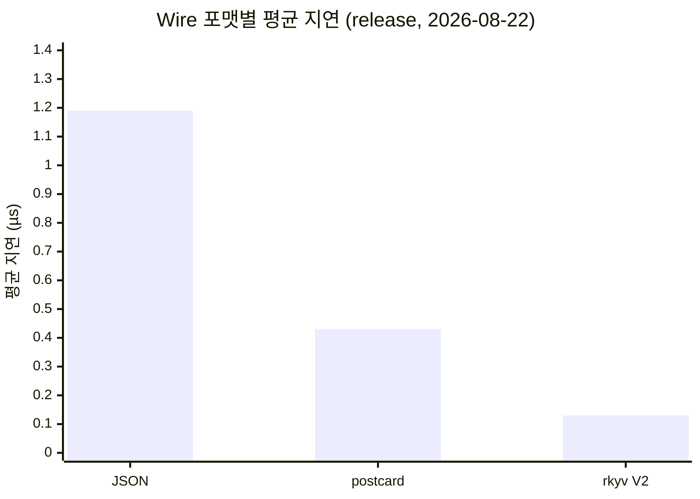
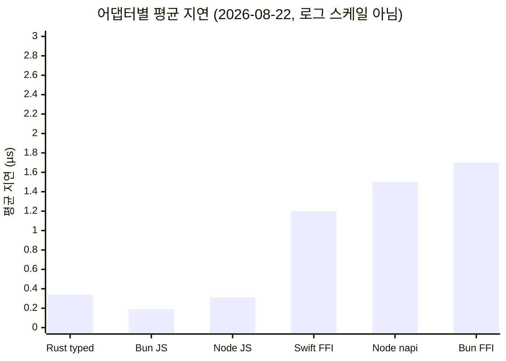

English | [한국어](./benchmarks.ko.md)

# Benchmarks

All measurements were taken on Apple Silicon (M-series). Unless noted otherwise,
each figure is the receipt from the date written in its table. Bun FFI was
re-measured on 2026-08-23 with Bun 1.4.0, and the React Native headline figures
are from the previous Release runs of the same date. After the measurement code
changes, past numbers are not treated as execution evidence of the current checkout.

## Test Environment

| Item          | Version                      |
| ------------- | ---------------------------- |
| OS            | macOS (Darwin 25.3.0, arm64) |
| Rust          | stable, aarch64-apple-darwin |
| Node.js       | v22.21.1                     |
| Bun           | 1.4.0                        |
| React Native  | 0.81.5 + Expo 54             |
| iOS simulator | iPhone 17                    |

## Complex binary codec receipt (2026-08-27)

The complex path measures the JS codec cost in a separate receipt.

```bash
bun run bench:complex
```

A sample run on the current checkout gave, for nested map + Option + Set + data enum,
request 47 B, response 53 B, encode 5.678 µs, decode 5.556 µs. These figures are
wall-clock samples of a single macOS process and do not include the Rust handler,
C++ JSI marshalling, or real RN device performance. Do not sum them directly with the
existing host benchmarks or read them as RN runtime figures. The original receipt is
[`2026-08-27-complex-codec.json`](benchmark-receipts/2026-08-27-complex-codec.json).

## FFI caller-buffer residual measurements (2026-08-28)

After completing the three remaining caller-buffer roadmap items (the Bun adapter
`_into`, async response caller-buffer, and the complex-route core into-handler),
before/after was measured on the same machine. Method: against the same integrated
release dylib (`examples/calculator`), (a) the malloc path = base adapter behavior
(`rustra_ffi_invoke_rkyv_v2` + copy then free) and (b) the into path =
`rustra_ffi_invoke_rkyv_v2_into` + a reused 512B caller buffer were alternated within
the same process (best-of-5 rounds). The full round trip of the base adapter
(98cdb689 `@rustra/bun`) and the integrated adapter was also cross-run against the
same dylib to produce 4-pair medians. Environment: macOS arm64 (Apple M-series,
10 core), Bun 1.4.0, Rust release. The load average at measurement time was 8–13, so
this is not a reproducible measurement — read it as a relative comparison.

### Bun adapter — transport isolation (F2)

Figures from calling the malloc symbol and the `_into` symbol directly on the same dylib.

| Command (response size)               | malloc (base behavior) | into (F2) |   Savings |
| ------------------------------------- | ---------------------: | --------: | --------: |
| addNumbers (9B, complex)              |              ~3,400 ns | ~3,150 ns |    ~7–10% |
| benchEchoBytes (73B, 512B↑)           |                 456 ns |    222 ns | **51.3%** |
| benchEchoBytes (610B, overflow+retry) |                 681 ns |    648 ns |       ~5% |

At 73B responses the halving happens because the 512B caller buffer absorbs the
response, eliminating both the Rust malloc/free and the JS copy (once). The 610B
response flows into an exact-size heap retry after overflow (the `usize::MAX` state),
so the savings are small — the primary target of caller-buffer is "many small
responses". The lower bound, with the `slice` copy at the reused buffer boundary
removed (pure FFI savings), goes down to 86ns (a further 60% versus into's 218ns).

### Bun adapter — full round trip (F2)

This is the full `createBunFfiEngine` round trip including codec encode/decode, the
engine, and the FFI. It is the median of 4 cross-measured pairs of the base adapter
(malloc path) and the integrated adapter (`_into` path) against the same dylib.

| Command (response size)   | base adapter | integrated | savings         |
| ------------------------- | -----------: | ---------: | --------------- |
| echo 64B (73B response)   |       899 ns |     567 ns | **~37% (1.6x)** |
| echo 600B (611B response) |     1,354 ns |   1,208 ns | ~11%            |
| addNumbers (9B response)  |     3,772 ns |   3,350 ns | ~11%            |

For the addNumbers/echo600 rows, the schema cost of the complex/buffer route dominates
and the caller-buffer savings stack on top. echo64's 37% reflects the small-payload
characteristic where FFI and copying account for nearly half of the total.

### RN complex into-handler (F1) — core complex route

F1 generates into-handlers for complex binary route commands as well (addNumbers,
echoGroups, etc. — oneOf/map/recursive schemas), opening the `DirectResponse::Written`
path. An echoGroups probe confirmed the wire is byte-identical to the `complex_encode`
heap path (both 57B/66,783B responses: into == malloc). The measured effect is small —
it removes a single Vec allocation+copy on response encoding — because the complex
route is dominated by the schema work of complex_decode → `serde_json::from_value` →
handler → `serde_json::to_value` → encode:

| Command (complex route)     |     malloc |  into (F1) | savings |
| --------------------------- | ---------: | ---------: | ------: |
| addNumbers 9B response      |   2,905 ns |   2,836 ns |    2.4% |
| echoGroups 66,783B response | 232,613 ns | 228,004 ns |    2.0% |

F1's value is therefore contract unification rather than performance — caller-buffer
hosts (C++ typedInvokeTail, Bun) receive Written for complex-route commands without a
malloc fallback, and on buffer exhaustion the existing `Buffered` fallback preserves
the exactly-once execution contract (including a total payload-limit guard counting
the header). Note that echoGroups into on the base dylib produced the same wire via the
pre-F1 Buffered fallback, so wire compatibility is OTA-safe.

### Async response caller-buffer (F3)

F3 removes the `std::vector frame` copy in the RN C++ async response and makes the core
`rustra_ffi_invoke_rkyv_v2_async_into` write directly into the caller buffer. RN
simulator benches are not covered in this section (the C++ gate is not in CI, so
device smoke is the actual measuring party). Facts verified at the core level:

- The worker-pool round trip itself runs async into at ~0.6–1.6 µs/op by the JS batch
  driver's reckoning, and the owned=0 (caller-buffer written) contract removes one
  owned-frame malloc/free pair per response.
- Immediate failures (payload-too-large/backpressure) complete on the calling thread,
  and even when a queued delivery lambda is destroyed during teardown/reload, a
  shared_ptr custom deleter guarantees exactly-once free (recovering the leak-free
  property of the older std::vector path).
- Thread-local probe reuse was judged cross-thread unsafe and replaced with a
  single-dispatch owned-flag design — retries are exactly-once even without a probe
  cache. (Evidence: 320 added lines in `crates/rustra/tests/trust_baseline_ffi.rs`)

## Track B measurements — scope of the wide-int C++ direct path completed (2026-08-29)

The completed scope of Track B (C++ bigint/Set direct path) this round is **Set with
int64/uint64 primitive elements and the C++ int64/uint64 native decode path** (a
3-surface wire gate: `wire_fixtures.rs` ↔ `cross-wire.test.ts` ↔ C++
`test-rustra-generated-codecs.cpp` share the `wideAgg`/`tagSet` PINNED hex
byte-exactly).

### JS codec path measurements (bun, this machine)

To quantify the cost of the path that the C++ direct path replaces, the calculator
example's generated codecs (`wideAggCodec`/`tagSetCodec`) were measured with the same
recipe as `scripts/complex-codec-bench.mjs` (warmup 2,000 + wall-clock 20,000 runs,
per-call writer/response allocation, machine-readable receipt). Encode uses the PINNED
fixture request payload; decode uses the PINNED fixture response body (boundary values —
the multi-byte varint64/zigzag64 paths). Median of 3 runs:

| Command (schema)                     |   encode |       decode | wire size                    |
| ------------------------------------ | -------: | -----------: | ---------------------------- |
| wideAgg (Vec\<u64\> + Option\<i64\>) | 1.699 µs | **0.455 µs** | request 36 B / response 28 B |
| tagSet (Set\<i64\> → Set\<string\>)  | 0.979 µs |     1.179 µs | request 7 B / response 23 B  |

```bash
bun scripts/track-b-bench.mjs
```

The original receipt is
[`2026-08-29-track-b.json`](benchmark-receipts/2026-08-29-track-b.json).

### Device smoke still required

Measuring the C++ direct path itself (encode/decode time inside RN JSI) is impossible in
this environment — the C++ codec test harness (`run-cpp-codec-tests.sh`) is an accuracy
gate with no timer, and the JSI native path only runs inside an RN runtime. As with
Track F's RN async bench (PR #45), **device/simulator smoke is left as follow-up work**.
As a reference, the JS figures above can be read as the upper bound of the pre-direct
path: C++ direct moves this encode/decode into native code minus JSI Value marshalling,
and the direct-marshalling savings pattern observed in Track F (51% transport isolation,
37% echo64 round trip) is the ceiling. The measurement environment had a load average of
8–13 (not reproducible), so these are relative comparison baselines, not absolute figures.

## 2026-08-24 real host API performance (`0.4.0` merge candidate)

The earlier adapter-only numbers excluded transport costs and did not match the latency
real users see. This measurement calls the generated entry points or the documented
production escape hatches in real runtimes. Every path validates the `42` result before
and after timing and repeats 3 times after warm-up.

```bash
bun run bench:hosts -- --output /tmp/rustra-host-matrix.json
```

Environment: macOS arm64, Bun 1.4.0, Node v22.21.1, Rust release. The original figures
are preserved in
[`2026-08-24-host-matrix.json`](benchmark-receipts/2026-08-24-host-matrix.json).

| Path                            | warm-up | repetitions      |       mean |        p50 |        p95 |        p99 |   ops/s |
| ------------------------------- | ------: | ---------------- | ---------: | ---------: | ---------: | ---------: | ------: |
| Node generated one-shot         |      10 | 200 × 3          |   2.758 ms |   2.760 ms |   3.119 ms |   3.295 ms |     363 |
| Node persistent loop            |     100 | 2,000 × 3        |  16.863 µs |  16.666 µs |  26.917 µs |  44.084 µs |  59,301 |
| Node N-API rkyv V2              |     500 | 10,000 × 3       |   1.261 µs |   1.167 µs |   2.125 µs |   4.292 µs | 793,185 |
| Bun generated FFI rkyv V2       |     500 | 10,000 × 3       |   2.273 µs |   2.208 µs |   3.917 µs |   6.292 µs | 439,961 |
| Tauri generated WebView IPC     |     100 | 1,000 × 3        | 279.044 µs | 300.000 µs | 350.000 µs | 550.000 µs |   3,584 |
| RN generated JSI, iOS Simulator |     500 | 10,000 × 1 check |          — |   2.750 µs |          — |          — |       — |

All means and throughput figures use a trimmed mean excluding the outermost 5% on each
end to reduce OS scheduling tails. Tauri computes percentiles as per-call latency of a
20-call batch to avoid WKWebView's ~1ms timer granularity. The RN row is the Rustra add
p50 of that day's final fingerprint Release receipt; since its execution environment
differs from Node/Bun/Tauri, no direct ranking is claimed.

The design conclusions from this table:

- Node's zero-config one-shot is for CLIs and low-frequency batches. A server hot path
  cut mean latency ~164x with the persistent loop and ~2,188x with N-API rkyv V2.
- Bun's default generated path is already stable C ABI rkyv V2, so there is no separate
  high-performance configuration.
- Tauri UI commands are dominated by WebView IPC. Several hundred µs suffices for user
  interaction, but per-frame bulk calls should be merged into a single Rust batch command.
- Expo development builds and bare RN use the same generated JSI/autolinking package.
  However, since there is no bare RN or Android real-runtime receipt yet, the iOS
  Simulator figures are not ported into claims.

Runnable product code lives in
[`examples/calculator/apps`](../examples/calculator/apps/),
[`examples/tauri-calculator`](../examples/tauri-calculator/),
[`examples/react-native-calculator/App.tsx`](../examples/react-native-calculator/App.tsx),
and
[`examples/react-native-bare-calculator/App.tsx`](../examples/react-native-bare-calculator/App.tsx).

## 2026-08-22 full re-measurement (`0.3.0` preparation checkout)

Every in-repo benchmark was re-run in this checkout and the document figures unified.
The 2026-08-18 session's wire/napi/core tables are replaced by these values.

### Rust release wire benchmark

`cargo run -p rustra-calculator-example --bin wire-bench --release`

| Path                       | Request | Response |       mean |        p50 |          throughput |
| -------------------------- | ------: | -------: | ---------: | ---------: | ------------------: |
| JSON `invoke`              |    47 B |     34 B |    1.19 µs |    1.17 µs |       842,640 ops/s |
| postcard `invoke_postcard` |    13 B |      4 B |     433 ns |     417 ns |     2,307,438 ops/s |
| rkyv V2 `invoke_rkyv_v2`   |     4 B |     10 B | **134 ns** | **125 ns** | **7,442,853 ops/s** |

→ rkyv V2 is ~8.9x faster than JSON and ~3.2x faster than postcard, with a request wire
~11.8x smaller than JSON.



### Node.js release N-API transport

`node scripts/transport-bench.mjs` (release native addon)

| transport           |        mean |       throughput |
| ------------------- | ----------: | ---------------: |
| Node N-API rkyv V2  | **~0.6 µs** | ~1,600,000 ops/s |
| Node N-API (String) |      1.5 µs |    654,817 ops/s |
| Node N-API (Buffer) |      2.0 µs |   ~500,000 ops/s |
| Node.js subprocess  |     3.40 ms |       ~294 ops/s |

→ In the same run, N-API is ~2,270x faster than subprocess. `rustraInvokeBuffer`
(the Buffer-returning variant) removes the UTF-16 double copy of the String round trip,
but at this size (47B request) the Buffer wrapping cost grows instead, measuring 2.0 µs —
it benefits large responses (without the variant, String is the faster range).
`rustraInvokeRkyvV2` (added 2026-08-23) round-trips the postcard frame over a direct
Buffer — 596ns on a quiet machine (it swells to 2.8µs at a system load average of 8+,
so record session conditions). The napi ABI's entry+Buffer fixed cost (~530ns) sets the
floor.

### Bun FFI transport

`bun scripts/transport-bench.mjs`

| profile                   |        mean |       throughput |
| ------------------------- | ----------: | ---------------: |
| Bun FFI rkyv V2 (release) | **~0.5 µs** | ~1,890,000 ops/s |
| Bun FFI JSON (release)    |      1.7 µs |   ~580,000 ops/s |
| Bun subprocess            |     5.73 ms |       ~175 ops/s |

> The rkyv V2 direct path (added 2026-08-23) calls the core
> `rustra_ffi_invoke_rkyv_v2` over a direct buffer — only postcard frames cross, with no
> JSON/UTF-16 round trip. The response's toArrayBuffer view references Rust memory, so
> materialize it as a value copy before freeing (a second copy is mandatory).

> **Profile warning** — with a debug native library loaded, Bun FFI measures
> **15.5 µs** (an unoptimized build). Benchmarks prefer the release dylib and annotate
> the name with `(debug)` if a debug one gets picked. Match the profile when comparing
> across sessions.

### Swift → Rust FFI (RN native layer)

`cd scripts/swift-ffi-bench && make` (linked against the release dylib)

| Path                                   |       mean |     throughput |
| -------------------------------------- | ---------: | -------------: |
| legacy JSON CString FFI (Swift → Rust) | **1.2 µs** |  853,614 ops/s |
| Full bridge (serialize → FFI → parse)  |     6.6 µs | ~151,000 ops/s |

This Swift table is a breakdown of the C ABI layer using a macOS dylib and Foundation
JSON. It excludes Hermes, JSI, and Nitro costs, so do not compute direct ratios against
the RN/Nitro headline figures.



## 2026-08-21 cold-start and allocation count additions (`0.3.0` preparation checkout)

`rustra-benchmark` gained global_allocator counting (atomic alloc/dealloc counters) and
cold-start separation. Per the 2026-08-22 re-measurement:

| Metric                                     | Value                           |
| ------------------------------------------ | ------------------------------- |
| First invoke (incl. tier resolution)       | ~1.8 µs (5.0–6.5x steady-state) |
| steady-state mean (1000 runs)              | 341–347 ns                      |
| `invoke_json` heap allocations per call    | 9 allocs / 9 deallocs           |
| `invoke_rkyv_v2` heap allocations per call | 4 allocs / 4 deallocs           |

Allocation counts are a more stable comparison metric than nanoseconds — copy-elimination
optimizations such as caller-buffer/Arc are validated as "reduced allocations" (the rkyv
V2 path halves the allocation count versus JSON).

## Rust Core Performance (`cargo run --release -p rustra-benchmark`)

### Package creation

```
Package::builder("...").command_fn(...).build()
```

| Metric | Value                |
| ------ | -------------------- |
| mean   | 12.7–13.1 µs         |
| p50    | (see Summary output) |

### Command invocation (typed)

```
package.invoke::<SimpleInput, SimpleOutput>("addNumbers", input)
```

| Metric                   | Value           |
| ------------------------ | --------------- |
| mean                     | 341–347 ns      |
| single-thread throughput | 2,913,359 ops/s |

### TypeScript code generation

| Metric | Value        |
| ------ | ------------ |
| mean   | 30.1–30.9 µs |

### Ser/de overhead (by data size, rkyv V2)

| Payload    | mean (invoke_json) |
| ---------- | -----------------: |
| 1 item     |            ~700 ns |
| 10 items   |            3.68 µs |
| 100 items  |            33.1 µs |
| 1000 items |             348 µs |

| Operation                    | Simple | 1000 items |
| ---------------------------- | -----: | ---------: |
| Serialization (to_value)     | 149 ns |     393 µs |
| Deserialization (from_value) | 240 ns |     705 µs |

## Rust Criterion debug Tier 3 baseline

Because the dynamic registry blocks mutation in release, it was measured with
`--profile dev`. The benchmark code only sets the sample size and uses Criterion's
default warm-up/measurement times. The tier comparison uses different representative
types and operations, so do not read 6.55x as the difference of the wire format alone.

| Path                          | mean (2026-08-22) |
| ----------------------------- | ----------------: |
| static Tier 1 postcard        |         605.57 ns |
| static Tier 2 postcard        |         865.83 ns |
| dynamic Tier 3 JSON-in-binary |         3.9677 µs |
| `register()` once             |          30.51 µs |
| `live_schema()` 3 commands    |          48.92 µs |
| mutable invoke                |           3.95 µs |
| frozen invoke                 |           3.94 µs |

Payload scaling was 12.33 µs, 64.39 µs, 606.14 µs, and 5.68 ms at 1/10/100/1000 items
respectively. As payload grows, JSON processing dominates dynamic Tier 3, so large
payloads should prefer static codec Tier 1/2 or a dedicated binary codec.

## Per-Adapter Performance Comparison

Based on a single `addNumbers({ a: 42, b: 58 })` call (10,000+ repetitions, release
builds, 2026-08-22).

| Adapter                |          mean latency | throughput (ops/s) |
| ---------------------- | --------------------: | -----------------: |
| Rust (typed invoke)    |            341–347 ns |          2,913,359 |
| Rust (JSON roundtrip)  |               ~287 ns |         ~3,480,000 |
| Bun (JS engine)        | 189 ns (prior record) |         ~5,284,714 |
| Node.js (JS engine)    |            297–299 ns |         ~3,350,000 |
| Swift → Rust FFI       |                1.2 µs |            853,614 |
| Node napi-rs (release) |                1.5 µs |            654,817 |
| Bun FFI (release)      |                1.7 µs |           ~580,000 |

> The JS adapter (Bun, Node) figures measure only the JS-side overhead of
> `EngineClient.invoke`; the actual IPC/FFI cost is separate.
> For the Nitro Modules and on-device RN comparison tables, see "measurement evidence"
> below.

## Transport End-to-End Performance

Based on a single `addNumbers({ a: 42, b: 58 })` call. Actual measured values including
Rust execution + serialization + transport overhead (2026-08-22, release).

| Transport                  | mean latency | throughput (ops/s) |
| -------------------------- | ------------ | -----------------: |
| **Node napi-rs (release)** | **1.5 µs**   |            654,817 |
| **Bun FFI (release)**      | **1.7 µs**   |           ~580,000 |
| Node.js subprocess (stdio) | 3.40 ms      |               ~294 |
| Bun subprocess (stdio)     | 5.73 ms      |               ~175 |

### Transport Overhead Analysis

```
Node napi-rs (release, 2026-08-22):
  Rust core + serde     ~0.13 µs   (8.7%)  ← wire-bench JSON 실측
  napi 브릿지 + JS      ~1.37 µs   (91.3%) ← napi 총지연 1.5µs − 코어

Bun FFI (release, 2026-08-23):
  Rust core + JSON serde ~1.1 µs
  JS JSON ser/de         ~0.16 µs
  Bun FFI 브릿지         ~0.42 µs
  총 실측                 ~1.7 µs
```

The breakdown is computed by subtracting the `wire-bench` values of the same JSON invoke
path. The rkyv V2 ~0.13µs is not substituted as the core cost of the JSON transport.

Under the debug profile these bridge costs inflate substantially — napi ~24.3 µs, Bun FFI
~15.5 µs (2026-08-18 debug session records). Only release measurements serve as the
comparison baseline.

### Running the Benchmarks

```bash
# Transport 벤치마크 (Node)
node scripts/transport-bench.mjs

# Transport 벤치마크 (Bun)
bun scripts/transport-bench.mjs

# Transport 성능 회귀 테스트
bun run test:runtime:node-napi
```

## React Native Performance

### React Native iOS Release equivalent-operation comparison (2026-08-24)

Measured on an iPhone 17 Simulator (iOS 26.2), Hermes, React Native 0.81.5 + Expo 54
Release app. Each operation is warm-up 500 + 10,000 runs, and Nitro and Rustra use the
same JS input shapes, the same operation, and the same output shape. bytes normalization
is included inside both measurement windows too. The raw `nitroBench.add(a, b)` call is
recorded only as a lower bound and is not used in ratios.

| Release run |  add object | string object |   bytes 64B | pair object | output equivalence |
| ----------- | ----------: | ------------: | ----------: | ----------: | :----------------: |
| 1           |     1.0474x |       1.0693x |     0.9543x |     1.0512x |         ✅         |
| 2           |     1.0255x |       1.0253x |     0.9249x |     1.0933x |         ✅         |
| 3           |     1.0418x |       1.0281x |     0.9817x |     1.0535x |         ✅         |
| **median**  | **1.0418x** |   **1.0281x** | **0.9543x** | **1.0535x** |       **✅**       |

The final build fingerprint of the 0.4 merge candidate,
`eb14a45517032caa6adbfb1b366da70ef1adcb69633e09eac07fd831f37a90b1`, also passed the same
Release gate. The paired ratios of a single verification run that re-linked and
re-installed the latest archive were add 1.0435x, string 1.0194x, bytes64 0.9580x,
pair 1.0511x, 64 KiB 0.9687x, 1 MiB-wire 0.9727x. A single run does not replace the
3-run median above as the representative performance figure; it is final confirmation
evidence that the deployment candidate and the measuring app share fingerprint, answers,
and CI gate.

Answers are validated before timing, and Nitro/Rustra/Swift FFI are measured in
per-call `ABC → BCA → CAB` rotation. Each receipt includes the log-ratio t 95% CI of 100
paired batches and automated diagnostics of the generated helper/native routes. The
receipt of the installed Release app is extracted without screen capture as follows:

```bash
bun run --cwd examples/react-native-calculator bench:ios:receipt -- \
  --output /tmp/rustra-rn-receipt.json
```

The extractor verifies build mode, correctness, FFI availability, CI fields, generation
timestamps, and app container file freshness. Debug builds and stale receipts from
previous runs fail.

Pre-binding the 2-field generated command to per-engine-generation native routes, the
real user-facing comparison add median is 4.18% slower than Nitro. Diagnostics of the
same native route as the generated function itself show a remaining ~5–12% JS
function/field extraction boundary. Reducing it further would require designing a
separate sync-only API boundary distinct from the current Promise-based public API, so
it was excluded from automatic routing optimization.

Representative synchronous breakdown ranges were typed by-id 591–620ns total,
positional 487–504ns total, JS codec ~3.1µs total, and JSON 24.1–24.5µs total. This
improvement is the combination of:

- Writing the Rust response directly into a 512B caller stack buffer and retrying only
  large responses at the exact size. Even on retry, the handler executes exactly once.
- The C++ request writer uses 128B of inline storage and writes f32/f64 in one shot.
- String responses are built from a `StringView` into a JSI string with no intermediate
  `std::string` copy.
- Generated commands use verified numeric command ids, and a synchronous transport with
  no options creates the public Promise exactly once. The cancellation/timeout option
  paths keep the existing contract as-is.

> Android shares the same `RustraJSIBridge.cpp`, but these figures are iOS Simulator
> based. Android emulator/physical device figures require separate verification.

### React Native direct byte-buffer comparison (2026-08-24)

`Uint8Array`/`ArrayBuffer` inputs are borrowed through a dedicated JSI entry point, and
the Rust output allocation is transferred to a JSI `MutableBuffer`, removing the response
`memcpy`. Both Nitro and Rustra honor the fresh-output contract, and there is one bulk
copy per echo. Each run validated result-byte equivalence before timing and alternated
the Nitro/Rustra order per call.

| Release run | 64 KiB Nitro | 64 KiB Rustra |      ratio | 1 MiB-wire Nitro | 1 MiB-wire Rustra |      ratio |
| ----------- | -----------: | ------------: | ---------: | ---------------: | ----------------: | ---------: |
| 1           |     8.540 us |      8.456 us |     0.990x |        87.979 us |         89.923 us |     1.022x |
| 2           |    12.815 us |      8.792 us |     0.686x |        84.797 us |         85.894 us |     1.013x |
| 3           |     9.256 us |      8.644 us |     0.934x |        88.909 us |         89.836 us |     1.010x |
| **median**  | **9.256 us** |  **8.644 us** | **0.934x** |    **87.979 us** |     **89.836 us** | **1.013x** |

The median of ratios is the 3-run median of per-call paired ratios, so it may differ from
a simple division of independent time medians. The second 64 KiB run was an outlier where
only the Nitro lane slowed transiently, but Rustra held 8.456–8.792 us in all three runs.
The representative figure is therefore the median of the three runs' paired ratios, not a
single run. 64 KiB is measured with warm-up 50 + 500 runs, and 1 MiB-wire with warm-up 20

- 200 runs to reduce variance.
  The data length of 1 MiB-wire is 1,048,571 bytes — the default wire limit minus the
  command id and 5 bytes of postcard length. A full 1 MiB of data is
  `payload.too_large` as intended.

Before the output ownership transfer, the medians were 64 KiB 24.174 us (2.344x Nitro)
and 1 MiB-wire 169.315 us (3.644x Nitro). The table above is the final re-measurement
after moving the install path — which had been patching Hermes directly from the
TurboModule queue — onto the JS Runtime thread. The new figures are local receipts of
iPhone 17 Simulator, iOS 26.2, Hermes, React Native 0.81.5 + Expo 54 Release, not
physical device or Android performance claims.

### Expo async bridge breakdown (2026-08-18 initial record)

Layer-by-layer breakdown of an `addNumbers` call measured on a real iOS simulator:

```
JSON ser/de (JS)       ▓▓                       2.9 µs    (5.5%)
RN bridge + FFI        ▒▒▒▒▒▒▒▒▒▒▒▒▒▒▒▒▒▒▒▒    40.2 µs   (76.6%)
EngineClient wrap      ░░                       9.3 µs    (17.7%)
                       ─────────────────────── ────────
Total                                            52.5 µs
```

On RN, most of the latency comes from crossing the Expo NativeModule async bridge. The
Rust FFI call itself was 3.5 µs at the time (1.2 µs in the current re-measurement) — only
~7% of the total.

The 3-run median of the same input/output in the latest 2026-08-24 Release receipt
maintains this conclusion. The FFI below is the entire Swift Expo async module, not the
raw C ABI alone.

| Equivalent operation | Nitro reference | Swift FFI async | FFI/Nitro |
| -------------------- | --------------: | --------------: | --------: |
| add                  |        2.882 us |       30.474 us |   10.575x |
| string               |        2.965 us |       30.858 us |   10.526x |
| bytes64              |       19.086 us |       38.710 us |    2.027x |
| pair                 |        2.998 us |       30.621 us |   10.421x |

Since the Swift sync scalar lower bound was 12.459 us, the default path for
ultra-high-frequency commands should be direct JSI, not the Expo async FFI. Leave the
FFI as the compatibility/control path and use it for amortizing bridge costs by handing
over large work in one call.

The single verification run of the 0.4 final fingerprint also kept the same conclusion,
with FFI/Nitro of add 11.1423x, string 10.8161x, bytes64 2.1113x, pair 10.9772x.

### JSI + rkyv V2 postcard (2026-08-18 record)

JSI synchronous calls + postcard binary serialization eliminate the async bridge overhead entirely:

```
Postcard encode (JS)    ▓▓▓▓                      2.4 µs   (63%)
Rust FFI dispatch       █                          761 ns   (20%)
Postcard decode (JS)    ██                         1.0 µs   (26%)
                        ────────────────────────  ──────
Total (sync)                                       3.8 µs

Promise.resolve wrap                               2.0 µs
                        ────────────────────────  ──────
Total (async)                                      5.8 µs
```

The Rust FFI dispatch measured 761ns. Postcard binary serialization removed the
JSON.parse overhead (27.5µs), and JSI synchronous calls removed the async bridge
overhead (40.2µs).

### Measurement evidence review (2026-08-22 documentation consistency audit)

**Tables removed** from this document, and why:

- **iOS/Android "Rustra Direct C++ Fast-Path" comparison table** (iOS 0.95 µs /
  Android 1.50 µs, including a superiority claim versus Nitro)
- **Payload complexity scaling table** (1.5/2.1/3.4 µs at Tier 1/2/3, a "12.3x faster
  than Nitro" claim)
- **Per-tier performance (Android Hermes) table** (addNumbers 6.1 µs / greet 7.2 µs)

Tracing the provenance of these figures showed that the `Lynx (Direct C++ Fast-Path)
0.95 µs` table, written from 2026-08-11 Lynx-era measurements, had been **renamed only**
to "Rustra Direct C++ Fast-Path" in the same commit (d888fc86). The table survived even
the Lynx removal (ecbe69c5). Since no measurement code for this path (a pure C++
fast-path bench) exists in the repo, it could not remain as a performance claim without
evidence to re-measure, so it was removed. RN measurements are replaced by the
BenchmarkApp records above; a new comparison table against Nitro Modules will be
re-established once measurable (building the comparison target app) and added.

## Nitro Modules Comparison — What Is and Is Not Measured

### Depth of the current comparison (BenchmarkApp + nitro-bench module)

The in-repo Nitro comparison rig uses commands of the same shape as a real HybridObject.
Within one process it alternates warmup 500 + 10K iterations in per-call rotating order
and records avg/stddev/min/max/p50/p95/p99 as a structured receipt:

- **Target**: the `nitro-bench` native module (`modules/nitro-bench/`) — a real
  HybridObject built with nitrogen codegen. The C++ implementation is
  `add(a, b) = a + b`, `echo(v) = v` (`ios/HybridNitroBench.cpp`).
- **Version**: `react-native-nitro-modules` **0.35.10** (installed). The "v0.80+" label
  in past ghost tables appears to have referred to the RN version, not a Nitro version.
- **Ratio measurement paths**: `benchAdd({a,b})`, `echoString({value})`,
  `echoBytes({data})`, `echoPair({name,value})` are implemented identically on both
  sides. The raw `nitroBench.add(42, 58)` is the floor and excluded from ratios.

There is exactly one question this comparison answers reliably:

> **"Is the end-to-end latency of the same public object API Nitro-grade?"** — Answer:
> by 3-run median, Rustra/Nitro add 1.0418x, string 1.0281x, bytes 0.9543x,
> pair 1.0535x (2026-08-24 Release measurement).

What this comparison does **not** cover (i.e., the above alone does not establish a
"fully supported" status):

- The string/bytes/pair comparison was **re-measured as equivalent operations on
  2026-08-24**. The 3-run medians are string 1.0281x, bytes 0.9543x, pair 1.0535x. The
  earlier greet/sizeOf/createItem comparisons used different operations and output
  shapes, so they were not fair ratios and were replaced by the equivalent-operation
  table above.

- The bigint/Date/Promise native/callback (Function argument) paths remain unmeasured.
- Payload sizes are measured up to 64B, 64KiB, and exact 1MiB-wire. Larger default
  inputs are rejected under the `payload.too_large` contract.
- Feature parity — see the matrix below. Latency comparison is no substitute for
  feature support.

### Feature parity matrix: rustra vs Nitro Modules

Nitro is designed as a "JS ↔ native object bridge", rustra as a "single Rust core ×
multi-host RPC contract" — different design goals. They overlap on only one problem
(calling Rust/C++ logic from RN). The following is based on the actual type surface of
the installed Nitro 0.35.10 (`cpp/jsi/JSIConverter*`) and the rustra codegen/codec surface.

#### Type System

| Type                     | Nitro 0.35.10                                  | rustra (postcard/rkyv V2 fast path)                                                                                                                                           | rustra fallback (Tier 3 JSON) |
| ------------------------ | ---------------------------------------------- | ----------------------------------------------------------------------------------------------------------------------------------------------------------------------------- | ----------------------------- |
| Integer/float primitives | ✅ int/float/double + **bigint(Int64/UInt64)** | ✅ f64/f32/zigzag integers + **uvar(u8–u64) plain varint** + `number                                                                                                          | bigint` wide-int restore      | ✅ (serde JSON) |
| string                   | ✅                                             | ✅                                                                                                                                                                            | ✅                            |
| bool / unit(void)        | ✅                                             | ✅                                                                                                                                                                            | ✅                            |
| Array Vec<T>             | ✅ Vector                                      | ✅ vec\_\*(per-sign integers/f64/bool/string/struct) + **Vec<u8>=bytes(len+raw)**                                                                                             | ✅                            |
| Set                      | — (as Vector)                                  | ✅ set\_\* (per-sign)                                                                                                                                                         | ✅                            |
| Tuple                    | ✅ Tuple                                       | ✅ **tuple (unprefixed listing)** — promoted to fast path 2026-08-22                                                                                                          | ✅                            |
| Map Record<string,T>     | ✅ AnyMap/UnorderedMap                         | ✅ **map\_\*(primitive-value maps count+(k,v)\*)** — promoted 2026-08-22. struct-valued maps fall back                                                                        | ✅                            |
| Option<T>                | ✅                                             | ✅ option\_\* (+option_uvar/option_bytes)                                                                                                                                     | ✅                            |
| enum (union variants)    | ✅ Variant                                     | ✅ string enums via postcard, data enums (oneOf) via deterministic complex binary                                                                                             | ✅                            |
| Struct (incl. nested)    | ✅ (objects)                                   | ✅ $ref recursion — postcard or complex binary, fallback for unsupported keywords                                                                                             | ✅                            |
| Date                     | ✅                                             | ✅ chrono DateTime — postcard keeps the ISO string as-is (naturally supported as string kind, probe-verified)                                                                 | ✅                            |
| ArrayBuffer/TypedArray   | ✅ (+ createNativeArrayBuffer)                 | ✅ **Vec<u8> bytes** — TS surface number[], C++ accepts both ArrayBuffer/arrays                                                                                               | ✅                            |
| Promise<T> (native)      | ✅                                             | ⚠️ JS wrapping (async engine level, core is synchronous)                                                                                                                      | same                          |
| Callbacks/function args  | ✅ Function                                    | ✅ **channel handles** (Tauri `ipc::Channel` model, 2026-08-23) — u32 handle argument, invocation-scoped unicast reply, RN JSI `createChannel`/`dropChannel`                  | same                          |
| Hybrid object references | ✅ NativeState/HybridObject/dispose            | ✅ **resource handles** (Tauri `Resource` model, 2026-08-23) — Rust-owned table (`channels::ChannelHost`), JS references only an integer id, `resource.not_found` after close | same                          |

#### Runtime/Platform

| Item                             | Nitro Modules                          | rustra                                                           |
| -------------------------------- | -------------------------------------- | ---------------------------------------------------------------- |
| Target hosts                     | React Native only                      | Node / Bun / Tauri / RN (iOS+Android) on a single core           |
| Implementation language          | C++/Swift/Kotlin (per platform)        | Single Rust + thin adapters per host                             |
| Codegen                          | nitrogen (interface → native bindings) | Schema → **bidirectional** (commands + events + TS client)       |
| Contract gates                   | ❌                                     | ✅ `rustra diff` + contract hash + wire round-trip gates         |
| Runtime command registration     | ❌                                     | ⚠️ dev only (register → frozen)                                  |
| Cancellation (AbortSignal)       | roll your own                          | ✅ RN rkyvV2 propagates to native checkpoints                    |
| Timeout                          | roll your own                          | ✅ timeoutMs (all adapters)                                      |
| Batch                            | roll your own                          | ✅ invokeBatch single JSI crossing (fail-fast)                   |
| Events (Rust→JS push)            | roll your own (possible via callbacks) | ✅ subscribeEvent/drainEvents (RN), register_with_events (Tauri) |
| Dynamic schema (self-describing) | ❌                                     | ✅ live_schema/dynamic Tier 3                                    |
| UI views (native components)     | ✅ HybridView                          | ❌ (out of scope — logic layer only)                             |

#### How to Read It

- **Where Nitro wins**: raw primitive call latency (specialized converters), rich native
  types (bigint/Date/ArrayBuffer/callbacks), object lifetime management, and UI views —
  specialized to the problem "build a native module".
- **Where rustra wins**: multi-host reuse of a single Rust core, bidirectional codegen
  with contract gates, documented cancellation/timeout/batch/event semantics, payload
  scaling on a binary wire, dynamic schema — specialized to the problem "own an RPC
  contract".
- In practice: for an RN-only app where primitive calls are the bottleneck, choose Nitro;
  to embed the same Rust logic in multiple hosts or to need contract management, choose
  rustra. The two can coexist (using a Nitro module as the transport inside a rustra
  adapter is also technically possible).

#### Meaning of the Gaps and Roadmap

In the matrix, a ❌ for rustra is not "unsupported" but falls into **3 classes**:

1. **Fast-path extension** (stage 1 completed 2026-08-22) — dynamic maps (primitive
   values), tuples, Vec<u8>/ArrayBuffer, u8–u64 plain varints, and chrono Date (ISO
   string) were implemented in the 3-surface (TS·Rust·C++) codegen and pinned with
   PINNED hex wire gates. The wide-int TS surface was completed by Track A (postcard
   fast path, `number | bigint` restore), and the C++ int64/uint64 native decode plus
   primitive-element Set direct path by Track B. The remaining C++ complex direct
   marshalling was resolved by complex-route into-handlers letting the core return
   `DirectResponse::Written` directly (2026-08-28, see "FFI caller-buffer residual
   measurements" above). C++ expansion for Sets of object/array elements and deeply
   recursive structures remains on the JS complex codec path.
2. **Schema-driven complex binary** (2026-08-27) — recursive structs, struct-valued
   maps, data enums, and nested Option/Set are handled with TS/Rust golden wires. On RN,
   the JS codec currently carries these to the Rust `invokeRkyvV2`; the C++ direct path
   has been extended to primitive-element Set and int64/uint64 (Track B, 2026-08-29),
   and the 2026-08-28 caller-buffer residual track completed the core into-handler plus
   the Bun/async response caller buffers, converging host copies to a single response
   boundary. C++ expansion for Sets of object/array elements and deeply recursive
   structures remains a separate performance extension.
3. **Reframed as channels/resources** (stage 2 completed 2026-08-23) — callbacks and
   object references. Rather than building a JS-first object bridge like Nitro, the
   Tauri v2 models — `ipc::Channel<T>` (callbacks as serializable channel handles) and
   `Resource` (objects exposed as Rust-owned handle ids, methods via codegen) — were
   brought into the rustra contract. Implementation: core `channels.rs` (a global
   `ChannelHost` table — u32 monotonic handles, no reuse, stale sends quietly false),
   FFI `rustra_ffi_channel_{create,send,drop}` (callbacks reply with their own handle),
   RN JSI `createChannel(cb)`/`dropChannel(h)` + `ChannelDispatcher` (the same
   queue+CallInvoker marshalling as EventDispatcher), and the calculator example
   `channelDemo`/`resourceOpen/Read/Write/Close` (KvResource, Mutex state). Only integer
   handles travel on the wire, so contract gates, bidirectional codegen, and multi-host
   consistency are preserved as-is — the difference that codegen direction is reversed
   (Nitro TS→native, rustra Rust→TS) also survives in this direction. Simulator E2E:
   channel ordering preservation of 3 payloads + drop, and resource
   open→read→write→close followed by `resource.not_found`.
4. **Confirmed out of scope** — HybridView (UI native views). It conflicts with the
   project definition of logic-layer-only and is a surface not serializable as a contract.

## Dynamic Command (runtime register, Tier 3) Performance

Performance of dynamic commands (registered at runtime via `register`, with the rkyv V2
**Tier 3 JSON-in-binary** fallback). Measured with criterion benchmarks
(`crates/rustra/benches/`).

> **Measurement environment warning**: dynamic commands are **dev-only by design**
> (release builds are frozen → `register` blocked). These figures were therefore
> measured on **debug (unoptimized) builds**. On debug, even the static postcard path is
> ~0.6–0.9 µs, tens of times slower than release (341–347 ns). Read these as **relative
> comparisons between tiers**, not absolute figures. In release, dynamic commands do not
> exist at all.

### Tier comparison — operation-controlled (same echo `{"v":7}` operation, only wire swapped) (debug, 2026-08-30)

`cargo bench -p rustra --bench tier_compare --profile dev`

> **Misreading warning (strengthened)**: the earlier table (2026-08-22) re-ran
> add/greet/echo — **different operations** — over different wires and presented "6.55x"
> as if it were a wire difference — a figure mixing operation effects with wire effects.
> The table below is an **operation-controlled comparison** swapping only the wire with
> the same operation (echo) and same payload (`{"v":7}`). Read against this table.

| Path (same echo operation)                                     | mean (2026-08-30) | wire multiple |
| -------------------------------------------------------------- | ----------------- | ------------- |
| static postcard (builder-registered `echo`)                    | 478 ns            | 1x            |
| dynamic postcard (runtime register `echo_dyn`, T2-1)           | 488 ns            | **1.02x**     |
| dynamic Tier 3 JSON (runtime register `echo_any`, 3-arm anyOf) | 4.75 µs           | **~9.9x**     |

→ As a pure wire comparison, dynamic Tier 3 JSON is **~10x** slower than static postcard
— JSON serialization/parsing dominates. (The old table's 6.55x coincidentally resembles
this value but mixes operations, so do not cite it. The 2026-08-18 "1.44x" claim was
discarded as a measurement error.)

(T2-1) Dynamic commands with a postcard-supported schema receive a postcard handler, and
(T2-3) the JS engine uses the same wire via the live schema interpreter. Result:
**dynamic postcard 488 ns — 1.02x versus static 478 ns** (the 2x target met, gap
eliminated). Tier 3 JSON is now used only for schemas rejected by both postcard and
complex (e.g. 3-arm untagged anyOf), and `echo_any` is its representative. The old
table's "dynamic Tier 3 (2026-08-22) 3.69 µs" is from the era when `echo_dyn` was
Tier 3; after T2-1 `echo_dyn` was promoted to postcard and is no longer Tier 3, so take
care when citing.

### Runtime registry costs (debug, 2026-08-22)

`cargo bench -p rustra --bench dynamic_registry --profile dev`

| Operation                                   | mean     | notes                                  |
| ------------------------------------------- | -------- | -------------------------------------- |
| `register()` once (incl. schema generation) | 30.51 µs | not a hot path (once, at registration) |
| `live_schema()` lookup (3 commands)         | 48.92 µs | read-only, in both debug/release       |
| `invoke_rkyv_v2` (mutable package)          | 3.95 µs  | RwLock read path                       |
| `invoke_rkyv_v2` (frozen package)           | 3.94 µs  | **under 0.2% difference** from mutable |

### Dynamic command payload scaling (debug, 2026-08-30)

`cargo bench -p rustra --bench type_scaling --profile dev`

(After T2-1) `processPayload` (PayloadInput: Vec<Item>) is a postcard-supported shape, so
dynamic registration gives it a postcard handler — the bench was updated to measure a
postcard round trip (the old `type_scaling_tier3` group retired).

| Item count | mean (dynamic postcard) |
| ---------- | ----------------------- |
| 1          | 1.45 µs                 |
| 10         | 6.54 µs                 |
| 100        | 56.96 µs                |
| 1000       | 579.1 µs                |

→ Linear growth with data size (proportional to postcard serialization cost), roughly an
**8–10x** improvement over the old Tier 3 JSON figures (2026-08-22: 12.33 µs / 64.39 µs /
606.14 µs / 5.68 ms).

### Running the Benchmarks

```bash
# 동적/Tier 3 경로는 register 로만 도달 → debug 빌드 필수.
cargo bench -p rustra --bench tier_compare    --profile dev
cargo bench -p rustra --bench dynamic_registry --profile dev
cargo bench -p rustra --bench type_scaling    --profile dev
```

The original figures are preserved in
[`2026-08-30-dynamic-postcard.json`](benchmark-receipts/2026-08-30-dynamic-postcard.json).

## JS Adapter JSON Performance

| Operation                  | Node.js (2026-08-22) | Bun (prior record) |
| -------------------------- | -------------------: | -----------------: |
| JSON.parse (simple)        |           211–224 ns |             127 ns |
| JSON.stringify (simple)    |             94–96 ns |              61 ns |
| EngineClient.invoke        |           297–299 ns |             189 ns |
| JSON.parse (100 items)     |    (not re-measured) |            23.8 µs |
| JSON.stringify (100 items) |    (not re-measured) |            33.6 µs |
| Object spread copy         |    (not re-measured) |              19 ns |

## How to Run the Benchmarks

```bash
# Rust 전체 벤치마크 (Summary 차트는 실측치 기반)
cargo run --release -p rustra-benchmark

# Node.js 어댑터 벤치마크
node scripts/adapter-bench.mjs

# Bun 어댑터 벤치마크
bun scripts/adapter-bench.mjs

# Complex binary codec JS path (nested map/Set/data enum)
bun run bench:complex

# Track B — wideAgg/tagSet JS codec path (C++ 직결이 대체하는 경로의 비용)
bun scripts/track-b-bench.mjs

# Swift FFI 벤치마크 (macOS, release dylib 필요)
cd scripts/swift-ffi-bench && make

# React Native 벤치마크 (iOS 시뮬레이터, Release 강제)
cd examples/react-native-calculator
bunx --bun expo run:ios --configuration Release
```
