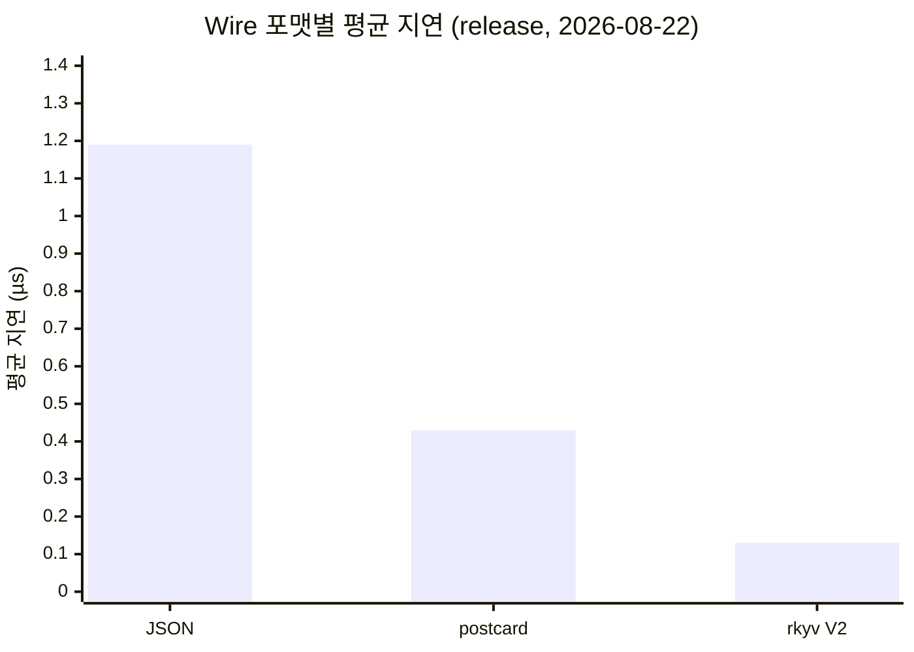
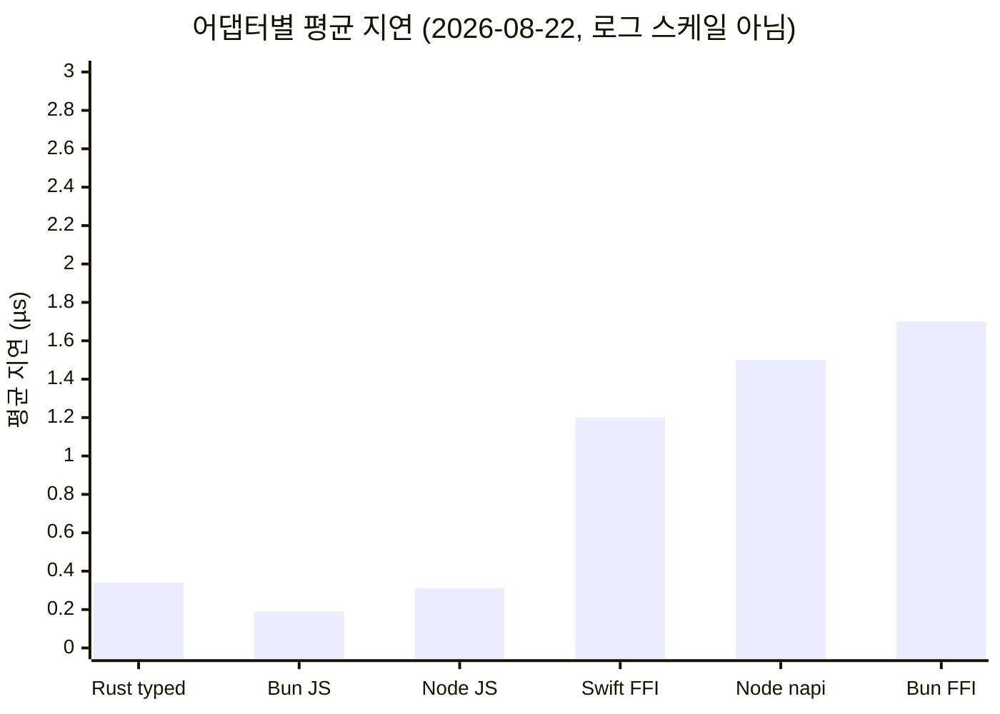

# 벤치마크

모든 측정은 Apple Silicon (M-series) 환경에서 수행했다. 달리 표기하지 않은
수치는 각 표에 적힌 날짜의 영수증이다. Bun FFI는 2026-08-23 Bun 1.4.0에서
다시 측정했고, React Native headline은 같은 날짜의 이전 Release 실행 기록이다.
측정 코드가 바뀐 뒤에는 과거 숫자를 현재 checkout의 실행 증거로 간주하지 않는다.

## 테스트 환경

| 항목           | 버전                         |
| -------------- | ---------------------------- |
| OS             | macOS (Darwin 25.3.0, arm64) |
| Rust           | stable, aarch64-apple-darwin |
| Node.js        | v22.21.1                     |
| Bun            | 1.4.0                        |
| React Native   | 0.81.5 + Expo 54             |
| iOS 시뮬레이터 | iPhone 17                    |

## 2026-08-22 전체 재측정 (`0.3.0` 준비 checkout)

이번 checkout에서 모든 인레포 벤치마크를 재실행해 문서 수치를 일신했다.
2026-08-18 세션의 wire/napi/코어 표는 이 값으로 대체됐다.

### Rust release wire benchmark

`cargo run -p rustra-calculator-example --bin wire-bench --release`

| 경로                       | 요청 | 응답 |       평균 |        p50 |              처리량 |
| -------------------------- | ---: | ---: | ---------: | ---------: | ------------------: |
| JSON `invoke`              | 47 B | 34 B |    1.19 µs |    1.17 µs |       842,640 ops/s |
| postcard `invoke_postcard` | 13 B |  4 B |     433 ns |     417 ns |     2,307,438 ops/s |
| rkyv V2 `invoke_rkyv_v2`   |  4 B | 10 B | **134 ns** | **125 ns** | **7,442,853 ops/s** |

→ rkyv V2는 JSON보다 약 8.9배, postcard보다 약 3.2배 빠르며 요청 wire는
JSON 대비 약 11.8배 작다.



### Node.js release N-API transport

`node scripts/transport-bench.mjs` (release 네이티브 애드온)

| transport           |        평균 |           처리량 |
| ------------------- | ----------: | ---------------: |
| Node N-API rkyv V2  | **~0.6 µs** | ~1,600,000 ops/s |
| Node N-API (String) |      1.5 µs |    654,817 ops/s |
| Node N-API (Buffer) |      2.0 µs |   ~500,000 ops/s |
| Node.js subprocess  |     3.40 ms |       ~294 ops/s |

→ 동일 실행에서 N-API가 subprocess보다 약 2,270배 빠르다. `rustraInvokeBuffer`
(Buffer 반환 변형)는 String 왕복의 UTF-16 이중 복사를 제거하지만, 이 크기
(47 B 요청)에서는 오히려 Buffer 래핑 비용이 커져 2.0 µs로 측정됐다 — 대형
응답에서 이점이 있다(변형이 없으면 String이 빠른 구간). `rustraInvokeRkyvV2`
(2026-08-23 추가)는 postcard 프레임을 Buffer 직결로 왕복한다 — 조용한
머신 실측 596ns(시스템 로드 평균 8+에서는 2.8µs까지 부풀므로 세션 조건을
기재할 것). napi ABI의 진입+Buffer 고정비(~530ns)가 하한을 만든다.

### Bun FFI transport

`bun scripts/transport-bench.mjs`

| 프로필                    |        평균 |           처리량 |
| ------------------------- | ----------: | ---------------: |
| Bun FFI rkyv V2 (release) | **~0.5 µs** | ~1,890,000 ops/s |
| Bun FFI JSON (release)    |      1.7 µs |   ~580,000 ops/s |
| Bun subprocess            |     5.73 ms |       ~175 ops/s |

> rkyv V2 직결 경로(2026-08-23 추가)는 코어 `rustra_ffi_invoke_rkyv_v2`를
> 버퍼 직결로 호출한다 — JSON/UTF-16 왕복 없이 postcard 프레임만 오간다.
> 응답의 toArrayBuffer 뷰는 Rust 메모리를 참조하므로 free 전에 값 복사로
> materialize 한다(2차 복사 필수).

> **프로필 주의** — debug 네이티브 라이브러리를 로드하면 Bun FFI는
> **15.5 µs**로 측정된다(최적화가 꺼진 빌드). 벤치마크는 release dylib을
> 우선 로드하며, debug로 잡힐 경우 이름에 `(debug)`를 표기한다. 세션 간
> 비교는 프로필을 맞춰야 한다.

### Swift → Rust FFI (RN 네이티브 계층)

`cd scripts/swift-ffi-bench && make` (release dylib 링크)

| 경로                                   |       평균 |         처리량 |
| -------------------------------------- | ---------: | -------------: |
| legacy JSON CString FFI (Swift → Rust) | **1.2 µs** |  853,614 ops/s |
| Full bridge (serialize → FFI → parse)  |     6.6 µs | ~151,000 ops/s |

이 Swift 표는 macOS dylib과 Foundation JSON을 쓰는 C ABI 레이어 분해다. Hermes,
JSI, Nitro 비용을 포함하지 않으므로 RN/Nitro headline과 직접 비율을 계산하지 않는다.



## 2026-08-21 콜드스타트·할당 수 측정 추가 (`0.3.0` 준비 checkout)

`rustra-benchmark` 에 global_allocator 카운팅(할당/해제 원자 카운터)과
콜드스타트 구분이 추가됐다. 2026-08-22 재측정 기준:

| 지표                            | 값                                 |
| ------------------------------- | ---------------------------------- |
| 최초 invoke (tier 해결 포함)    | ~1.8 µs (steady-state의 5.0–6.5배) |
| steady-state 평균 (1000회)      | 341–347 ns                         |
| `invoke_json` 호출당 힙 할당    | 9 allocs / 9 deallocs              |
| `invoke_rkyv_v2` 호출당 힙 할당 | 4 allocs / 4 deallocs              |

할당 수는 나노초보다 안정적인 비교 지표다 — caller-buffer/Arc 같은 복사 제거
최적화의 효과를 "할당 감소"로 검증한다(rkyv V2 경로가 JSON 대비 할당 수 절반).

## Rust 코어 성능 (`cargo run --release -p rustra-benchmark`)

### 패키지 생성

```
Package::builder("...").command_fn(...).build()
```

| 지표 | 값                  |
| ---- | ------------------- |
| 평균 | 12.7–13.1 µs        |
| p50  | (Summary 출력 참조) |

### 명령 호출 (typed)

```
package.invoke::<SimpleInput, SimpleOutput>("addNumbers", input)
```

| 지표              | 값              |
| ----------------- | --------------- |
| 평균              | 341–347 ns      |
| 싱글스레드 처리량 | 2,913,359 ops/s |

### TypeScript 코드 생성

| 지표 | 값           |
| ---- | ------------ |
| 평균 | 30.1–30.9 µs |

### Ser/de 오버헤드 (데이터 크기별, rkyv V2)

| 페이로드   | 평균 (invoke_json) |
| ---------- | -----------------: |
| 1 item     |            ~700 ns |
| 10 items   |            3.68 µs |
| 100 items  |            33.1 µs |
| 1000 items |             348 µs |

| 연산                  | Simple | 1000 items |
| --------------------- | -----: | ---------: |
| 직렬화 (to_value)     | 149 ns |     393 µs |
| 역직렬화 (from_value) | 240 ns |     705 µs |

## Rust Criterion debug Tier 3 기준선

동적 registry는 release에서 mutation이 차단되는 설계이므로 `--profile dev`로
측정했다. benchmark 코드는 sample size만 지정하며 Criterion 기본 warm-up/
measurement 시간을 사용한다. tier 비교는 서로 다른 대표 타입과 연산이므로,
6.55x를 wire 포맷 하나만의 차이로 해석하지 않는다.

| 경로                       | 평균 (2026-08-22) |
| -------------------------- | ----------------: |
| 정적 Tier 1 postcard       |         605.57 ns |
| 정적 Tier 2 postcard       |         865.83 ns |
| 동적 Tier 3 JSON-in-binary |         3.9677 µs |
| `register()` 1회           |          30.51 µs |
| `live_schema()` 3 commands |          48.92 µs |
| mutable invoke             |           3.95 µs |
| frozen invoke              |           3.94 µs |

payload scaling은 1/10/100/1000 items에서 각각 12.33 µs, 64.39 µs,
606.14 µs, 5.68 ms였다. 동적 Tier 3은 payload가 커질수록 JSON 처리 비용이
지배적이므로, 대형 payload에는 정적 codec Tier 1/2 또는 별도 binary codec을
우선 사용해야 한다.

## 어댑터별 성능 비교

단일 `addNumbers({ a: 42, b: 58 })` 호출 기준 (10,000회 이상 반복, release 빌드,
2026-08-22).

| 어댑터                 |          평균 지연 | 처리량 (ops/s) |
| ---------------------- | -----------------: | -------------: |
| Rust (typed invoke)    |         341–347 ns |      2,913,359 |
| Rust (JSON roundtrip)  |            ~287 ns |     ~3,480,000 |
| Bun (JS engine)        | 189 ns (기존 기록) |     ~5,284,714 |
| Node.js (JS engine)    |         297–299 ns |     ~3,350,000 |
| Swift → Rust FFI       |             1.2 µs |        853,614 |
| Node napi-rs (release) |             1.5 µs |        654,817 |
| Bun FFI (release)      |             1.7 µs |       ~580,000 |

> JS 어댑터(Bun, Node) 수치는 `EngineClient.invoke` JS측 오버헤드만 측정한 것으로, 실제 IPC/FFI 비용은 별도다.
> Nitro Modules 및 RN 온디바이스 비교 표는 아래 "측정 근거 정리" 참고.

## Transport별 End-to-End 성능

단일 `addNumbers({ a: 42, b: 58 })` 호출 기준. Rust 실행 + 직렬화 + transport
오버헤드를 모두 포함한 실제 측정값 (2026-08-22, release).

| Transport                  | 평균 지연  | 처리량 (ops/s) |
| -------------------------- | ---------- | -------------: |
| **Node napi-rs (release)** | **1.5 µs** |        654,817 |
| **Bun FFI (release)**      | **1.7 µs** |       ~580,000 |
| Node.js subprocess (stdio) | 3.40 ms    |           ~294 |
| Bun subprocess (stdio)     | 5.73 ms    |           ~175 |

### Transport 오버헤드 분석

```
Node napi-rs (release, 2026-08-22):
  Rust core + serde     ~0.13 µs   (8.7%)  ← wire-bench JSON 실측
  napi 브릿지 + JS      ~1.37 µs   (91.3%) ← napi 총지연 1.5µs − 코어

Bun FFI (release, 2026-08-23):
  Rust core + JSON serde ~1.1 µs
  JS JSON ser/de         ~0.16 µs
  Bun FFI 브릿지         ~0.42 µs
  총 실측                 ~1.7 µs
```

분해는 같은 JSON invoke 경로의 `wire-bench` 값을 빼서 계산한다. rkyv V2
~0.13µs를 JSON transport의 core 비용으로 대입하지 않는다.

debug 프로필에서는 이 브릿지 비용이 크게 부풀어난다 — napi ~24.3 µs, Bun FFI
~15.5 µs (2026-08-18 debug 세션 기록). release 측정만 비교 기준으로 삼을 것.

### 벤치마크 실행

```bash
# Transport 벤치마크 (Node)
node scripts/transport-bench.mjs

# Transport 벤치마크 (Bun)
bun scripts/transport-bench.mjs

# Transport 성능 회귀 테스트
bun run test:runtime:node-napi
```

## React Native 성능

### React Native iOS Release 동등 연산 비교 (2026-08-23)

iPhone 17 Simulator(iOS 26.2), Hermes, React Native 0.81.5 + Expo 54의 Release
앱에서 측정했다. 각 연산은 warm-up 500회 + 10,000회이며 Nitro와 rustra가
같은 JS 입력 모양, 같은 연산, 같은 출력 모양을 사용한다. bytes 정규화도 양쪽
측정 구간 안에 포함한다. `nitroBench.add(a, b)` 원시 호출은 lower bound로만
기록하고 비율에는 사용하지 않는다.

| Release 실행 |    add 객체 | string 객체 |   bytes 64B |   pair 객체 | 출력 동등성 |
| ------------ | ----------: | ----------: | ----------: | ----------: | :---------: |
| 1            |     1.2068x |     1.2440x |     1.1486x |     1.1969x |     ✅      |
| 2            |     1.1828x |     1.2384x |     1.1656x |     1.2162x |     ✅      |
| 3            |     1.2223x |     1.2308x |     1.1748x |     1.2504x |     ✅      |
| **중앙값**   | **1.2068x** | **1.2384x** | **1.1656x** | **1.2162x** |   **✅**    |

이 표는 순차 측정 러너의 이전 기록이다. 최신 러너는 정답을 timing 전에 검증하고,
Nitro/Rustra/Swift FFI를 호출 단위로 `ABC → BCA → CAB` 순환 측정하며 avg,
stddev, min/max, p50/p95/p99, 100개 batch mean과 JSON receipt를 출력한다.
Debug 빌드에서는 성능 측정을 중단한다. 최신 소스의 Release runtime을 다시
실행하기 전에는 위 비율을 새 성능 결과로 승격하지 않는다.

최적화 전 같은 벤치의 중앙값은 add 1.3076x, string 1.3167x, bytes 1.1693x,
pair 1.3954x였다. Nitro 대비 초과 격차(`ratio - 1`)는 각각 약 33%, 25%, 2%,
45% 줄었다.

대표적인 동기 분해 범위는 typed by-id 전체 591–620ns, positional 전체
487–504ns, JS codec 전체 약 3.1µs, JSON 전체 24.1–24.5µs였다. 이번 개선은
다음을 합친 결과다.

- 512B caller stack buffer에 Rust 응답을 직접 기록하고 큰 응답만 정확한 크기로
  재시도한다. 재시도해도 핸들러는 한 번만 실행된다.
- C++ 요청 writer는 128B inline 저장소를 사용하고 f32/f64를 한 번에 기록한다.
- 문자열 응답은 중간 `std::string` 복사 없이 `StringView`에서 JSI 문자열로 만든다.
- 생성 명령은 검증된 숫자 command id를 사용하며, 옵션 없는 동기 transport는
  공개 Promise를 정확히 한 번만 생성한다. 취소/타임아웃 옵션 경로는 기존 계약을
  그대로 사용한다.

> Android는 같은 `RustraJSIBridge.cpp`를 공유하지만 이번 숫자는 iOS
> 시뮬레이터 기준이다. Android 에뮬레이터/실기기 수치는 별도 검증이 필요하다.

### React Native direct byte-buffer 비교 (2026-08-24)

`Uint8Array`/`ArrayBuffer` 입력을 전용 JSI 진입점으로 빌리고, Rust 출력
allocation을 JSI `MutableBuffer`로 이전해 응답 `memcpy`를 제거했다. Nitro와
Rustra 모두 fresh-output 계약을 지키며 echo 한 번당 bulk copy는 한 번이다.
각 실행은 timing 전에 결과 바이트 동등성을 검증했고, Nitro/Rustra 순서를
호출 단위로 교차했다.

| Release 실행 | 64 KiB Nitro | 64 KiB Rustra |       비율 | 1 MiB-wire Nitro | 1 MiB-wire Rustra |       비율 |
| ------------ | -----------: | ------------: | ---------: | ---------------: | ----------------: | ---------: |
| 1            |     8.640 us |      8.760 us |     1.014x |        94.483 us |         95.112 us |     1.007x |
| 2            |     9.388 us |      9.016 us |     0.960x |       102.912 us |         89.966 us |     0.874x |
| 3            |     9.883 us |      8.889 us |     0.899x |        94.748 us |         94.740 us |     1.000x |
| **중앙값**   | **9.388 us** |  **8.889 us** | **0.947x** |    **94.748 us** |     **94.740 us** | **1.000x** |

64 KiB는 warm-up 50회 + 500회, 1 MiB-wire는 warm-up 5회 + 50회다.
1 MiB-wire의 데이터 길이는 기본 wire limit에서 command id와 postcard 길이
5바이트를 뺀 1,048,571바이트다. 전체 1 MiB 데이터는 의도대로
`payload.too_large`다.

출력 소유권 이전 전 중앙값은 64 KiB 24.174 us(2.344x Nitro), 1 MiB-wire
169.315 us(3.644x Nitro)였다. 위 표는 TurboModule 큐에서 Hermes를 직접
수정하던 설치 경로를 JS Runtime 스레드로 옮긴 뒤의 최종 재측정이다. 새
수치는 iPhone 17 Simulator, iOS 26.2, Hermes, React Native 0.81.5 + Expo 54
Release의 로컬 영수증이며 실기기나 Android 성능 주장이 아니다.

### Expo async bridge 분해 (2026-08-18 초기 기록)

실제 iOS 시뮬레이터에서 측정한 `addNumbers` 호출의 레이어별 분해:

```
JSON ser/de (JS)       ▓▓                       2.9 µs    (5.5%)
RN bridge + FFI        ▒▒▒▒▒▒▒▒▒▒▒▒▒▒▒▒▒▒▒▒    40.2 µs   (76.6%)
EngineClient wrap      ░░                       9.3 µs    (17.7%)
                       ─────────────────────── ────────
Total                                            52.5 µs
```

RN에서 대부분의 지연은 Expo NativeModule 비동기 브릿지 통과에서 발생한다. Rust
FFI 호출 자체는 당시 3.5 µs(현재 재측정 1.2 µs)로 전체의 ~7%에 불과하다.

### JSI + rkyv V2 postcard (2026-08-18 기록)

JSI 동기 호출 + postcard 바이너리 직렬화로 async bridge 오버헤드를 완전히 제거:

```
Postcard encode (JS)    ▓▓▓▓                      2.4 µs   (63%)
Rust FFI dispatch       █                          761 ns   (20%)
Postcard decode (JS)    ██                         1.0 µs   (26%)
                        ────────────────────────  ──────
Total (sync)                                       3.8 µs

Promise.resolve wrap                               2.0 µs
                        ────────────────────────  ──────
Total (async)                                      5.8 µs
```

Rust FFI dispatch가 761ns로 측정됐다. postcard 바이너리 직렬화 덕분에
JSON.parse 오버헤드(27.5µs)를 제거했고, JSI 동기 호출로 async bridge
오버헤드(40.2µs)도 제거했다.

### 측정 근거 정리 (2026-08-22 문서 정합성 조사)

이 문서에서 **삭제된 표**와 그 이유:

- **iOS/Android "Rustra Direct C++ Fast-Path" 비교 표** (iOS 0.95 µs /
  Android 1.50 µs, Nitro 대비 우위 주장 포함)
- **페이로드 복잡도별 확장성 표** (Tier 1/2/3에서 1.5/2.1/3.4 µs, "Nitro 대비
  12.3x 빠름" 주장)
- **Tier별 성능 (Android Hermes) 표** (addNumbers 6.1 µs / greet 7.2 µs)

이 수치들의 계보를 추적한 결과, 2026-08-11 Lynx 시절 측정으로 작성된
`Lynx (Direct C++ Fast-Path) 0.95 µs` 표가 동일 커밋에서 "Rustra Direct C++
Fast-Path"로 **이름만 교체**된 것이었다 (커밋 d888fc86). 이후 Lynx 제거
(ecbe69c5)에서도 표가 유지됐다. 레포에 이 경로(순수 C++ fast-path 벤치)의
측정 코드가 존재하지 않아, 재측정 근거 없이는 성능 주장으로 남을 수 없어
삭제했다. RN 실측은 위 BenchmarkApp 기록으로 대체하며, Nitro Modules와의
신규 비교표는 측정 가능한 형태(comparison 대상 앱 구축)로 재수립한 뒤 추가한다.

## Nitro Modules 비교 — 무엇을 측정하고 무엇을 측정하지 않는가

### 현재 비교의 깊이 (BenchmarkApp + nitro-bench 모듈)

레포 안의 Nitro 비교 장치는 실제 HybridObject와 동일 shape 명령을 사용한다.
같은 프로세스에서 warmup 500회 + 10K iteration을 호출 단위 순환 순서로 재며,
avg/stddev/min/max/p50/p95/p99를 구조화 receipt로 남긴다:

- **대상**: `nitro-bench` 네이티브 모듈(`modules/nitro-bench/`) — nitrogen
  코드젠으로 만든 실제 HybridObject. C++ 구현은 `add(a, b) = a + b`,
  `echo(v) = v` (`ios/HybridNitroBench.cpp`).
- **버전**: `react-native-nitro-modules` **0.35.6** (설치된 것). 과거 유령
  표의 "v0.80+" 라벨은 Nitro 버전이 아니라 RN 버전을 가리킨 것으로 보인다.
- **비율 측정 경로**: `benchAdd({a,b})`, `echoString({value})`,
  `echoBytes({data})`, `echoPair({name,value})`를 양쪽에 동일하게 구현했다.
  원시 `nitroBench.add(42, 58)`는 하한선이며 비율에서 제외한다.

즉 이 비교가 확실하게 답하는 질문은 하나다:

> **"동일한 공개 객체 API의 엔드투엔드 지연이 Nitro급인가?"** — 답: 3회
> 중앙값 기준 rustra/Nitro 1.17–1.24x(2026-08-23 Release 측정)다.

이 비교가 **하지 않는** 것 (즉, 위 비교만으로 "full 지원 상태"를 체크했다고
말할 수 없다):

- string/bytes/pair 비교는 **2026-08-23 동등 연산으로 재측정 완료**했다.
  3회 중앙값은 string 1.2384x, bytes 1.1656x, pair 1.2162x다. 이전의
  greet/sizeOf/createItem 비교는 연산과 출력 모양이 달라 공정한 비율이 아니었으므로
  위 동등 연산 표로 대체했다.

- bigint/Date/Promise 네이티브/콜백(Function 인자) 경로는 여전히 미측정.
- 페이로드 크기 확장(64B 초과) 비교 — 향후 과제.
- 기능 패리티 — 아래 매트릭스 참고. 지연 비교가 기능 지원을 대신하지 않는다.

### 기능 패리티 매트릭스: rustra vs Nitro Modules

Nitro는 "JS ↔ 네이티브 객체 브릿지", rustra는 "단일 Rust 코어 × 멀티호스트
RPC 계약"으로 설계 목표가 다르다. 같은 문제만 겹친다(RN에서 Rust/C++ 로직
부르기). 아래는 설치된 Nitro 0.35.6의 실제 타입 표면(`cpp/jsi/JSIConverter*`)
과 rustra 코드젠/코덱 표면 기준.

#### 타입 시스템

| 타입                   | Nitro 0.35.6                                   | rustra (postcard/rkyv V2 fast path)                                                                                                                       | rustra 폴백(Tier 3 JSON) |
| ---------------------- | ---------------------------------------------- | --------------------------------------------------------------------------------------------------------------------------------------------------------- | ------------------------ |
| 정수/실수 프리미티브   | ✅ int/float/double + **bigint(Int64/UInt64)** | ✅ f64/f32/zigzag 정수 + **uvar(u8–u64) plain varint** — bigint 표면은 ❌(number, 2^53 한계)                                                              | ✅ (serde JSON)          |
| string                 | ✅                                             | ✅                                                                                                                                                        | ✅                       |
| bool / unit(void)      | ✅                                             | ✅                                                                                                                                                        | ✅                       |
| 배열 Vec<T>            | ✅ Vector                                      | ✅ vec\_\*(정수 부호별/f64/bool/string/struct) + **Vec<u8>=bytes(len+raw)**                                                                               | ✅                       |
| Set                    | — (Vector로)                                   | ✅ set\_\* (부호별)                                                                                                                                       | ✅                       |
| 튜플                   | ✅ Tuple                                       | ✅ **tuple(무접두 나열)** — 2026-08-22 fast-path 승격                                                                                                     | ✅                       |
| 맵 Record<string,T>    | ✅ AnyMap/UnorderedMap                         | ✅ **map\_\*(원시값 맵 count+(k,v)\*)** — 2026-08-22 승격. struct-값 맵은 폴백                                                                            | ✅                       |
| Option<T>              | ✅                                             | ✅ option\_\* (+option_uvar/option_bytes)                                                                                                                 | ✅                       |
| enum(union variant)    | ✅ Variant                                     | ⚠️ string enum ✅, **data enum(oneOf)은 폴백 확정** — schemars oneOf 가 unit variant 를 앞으로 재배치해 postcard 선언순 index 복원 불가(probe 실증)       | ✅                       |
| 구조체(중첩 포함)      | ✅ (객체)                                      | ✅ $ref 재귀 — 미지원 필드 있으면 폴백                                                                                                                    | ✅                       |
| Date                   | ✅                                             | ✅ chrono DateTime — postcard 는 ISO string 그대로(string kind로 자연 지원, probe 실증)                                                                   | ✅                       |
| ArrayBuffer/TypedArray | ✅ (+ createNativeArrayBuffer)                 | ✅ **Vec<u8> bytes** — TS 표면 number[], C++ 는 ArrayBuffer/배열 양쪽 수용                                                                                | ✅                       |
| Promise<T> (네이티브)  | ✅                                             | ⚠️ JS 래핑(async 엔진 레벨, 코어는 동기)                                                                                                                  | 동일                     |
| 콜백/함수 인자         | ✅ Function                                    | ✅ **채널 핸들**(Tauri `ipc::Channel` 모델, 2026-08-23) — u32 핸들 인자, 호출 귀속 유니캐스트 회신, RN JSI `createChannel`/`dropChannel`                  | 동일                     |
| 하이브리드 객체 참조   | ✅ NativeState/HybridObject/dispose            | ✅ **리소스 핸들**(Tauri `Resource` 모델, 2026-08-23) — Rust-소유 테이블(`channels::ChannelHost`), JS 는 정수 id 로만 참조, close 후 `resource.not_found` | 동일                     |

#### 런타임/플랫폼

| 항목                         | Nitro Modules                         | rustra                                                         |
| ---------------------------- | ------------------------------------- | -------------------------------------------------------------- |
| 대상 호스트                  | React Native 전용                     | Node / Bun / Tauri / RN(iOS+Android) 단일 코어                 |
| 구현 언어                    | C++/Swift/Kotlin (플랫폼별)           | Rust 단일 + 각 호스트 얇은 어댑터                              |
| 코드젠                       | nitrogen (인터페이스→네이티브 바인딩) | 스키마→**양방향**(커맨드+이벤트+TS 클라이언트)                 |
| 계약 게이트                  | ❌                                    | ✅ `rustra diff` + contract hash + wire round-trip 게이트      |
| 런타임 명령 등록             | ❌                                    | ⚠️ dev 전용(register→frozen)                                   |
| 취소(AbortSignal)            | 직접 구현                             | ✅ RN rkyvV2는 네이티브 전파(체크포인트)까지                   |
| 타임아웃                     | 직접 구현                             | ✅ timeoutMs(모든 어댑터)                                      |
| 배치                         | 직접 구현                             | ✅ invokeBatch 단일 JSI 횡단(fail-fast)                        |
| 이벤트 (Rust→JS 푸시)        | 직접 구현(콜백로 가능)                | ✅ subscribeEvent/drainEvents(RN), register_with_events(Tauri) |
| 동적 스키마(self-describing) | ❌                                    | ✅ live_schema/동적 Tier 3                                     |
| UI 뷰(네이티브 컴포넌트)     | ✅ HybridView                         | ❌ (범위 밖 — 로직 레이어 전용)                                |

#### 읽는 법

- **Nitro가 이기는 곳**: 원시 프리미티브 호출 지연(특화 변환기), 풍부한
  네이티브 타입(bigint/Date/ArrayBuffer/콜백), 객체 수명 관리와 UI 뷰 —
  "네이티브 모듈을 만든다"는 문제에 특화.
- **rustra가 이기는 곳**: 단일 Rust 코어의 멀티호스트 재사용, 계약 게이트가
  붙은 양방향 코드젠, 문서화된 취소/타임아웃/배치/이벤트 시맨틱, 바이널 wire의
  페이로드 확장성, 동적 스키마 — "RPC 계약을 소유한다"는 문제에 특화.
- 실제 선택은 RN 전용 앱에서 프리미티브 호출이 병목이면 Nitro, 여러 호스트에
  같은 Rust 로직을 심거나 계약 관리가 필요하면 rustra. 양쪽은 공존 가능하다
  (rustra 어댑터 안에서 Nitro 모듈을 transport로 쓰는 것도 기술적으로 가능).

#### 빈칸의 의미와 로드맵

매트릭스에서 rustra가 ❌인 타입은 "지원 안 됨"이 아니라 **3부류**다:

1. **fast-path 확장** (2026-08-22 1단계 완료) — 동적 맵(원시값), 튜플,
   Vec<u8>/ArrayBuffer, u8–u64 plain varint, chrono Date(ISO string)를
   3면(TS·Rust·C++) 코드젱에 구현하고 PINNED hex 와이어 게이트로 고정했다.
   남은 것: **bigint TS 표면**(현재 number — 2^53 정밀도 한계 문서화됨)과
   **data enum**(oneOf 순서 비결정성으로 Tier 3 폴백 확정 — postcard
   variant index는 Rust 선언순이나 schemars 가 재배치).
2. **채널/리소스로 재정의** (2026-08-23 2단계 완료) — 콜백과 객체 참조.
   Nitro처럼 JS-first 객체 브릿지를 만드는 게 아니라, Tauri v2의
   `ipc::Channel<T>`(콜백을 직렬화 가능한 채널 핸들로)·`Resource`(객체를
   Rust-소유 핸들 id로 노출, 메서드는 코드젠) 모델을 rustra 계약 안으로
   가져왔다. 구현: 코어 `channels.rs`(전역 `ChannelHost` 테이블 — u32 단조
   핸들, 재사용 없음, stale send 는 조용한 false), FFI
   `rustra_ffi_channel_{create,send,drop}`(콜백이 자기 핸들을 회신),
   RN JSI `createChannel(cb)`/`dropChannel(h)` + `ChannelDispatcher`
   (EventDispatcher 와 동일한 큐+CallInvoker 마샬링), calculator 예제
   `channelDemo`/`resourceOpen/Read/Write/Close`(KvResource, Mutex 상태).
   wire에 실리는 것은 정수 핸들이므로 계약 게이트·양방향 코드젠·멀티호스트
   일관성이 그대로 유지된다 — 코드젠 방향이 반대(Nitro는 TS→네이티브,
   rustra는 Rust→TS)라는 차이도 이 방향에서는 그대로 살아있다. 시뮬레이터
   E2E: 채널 3페이로드 순서 보존 + drop, 리소스 open→read→write→close 후
   `resource.not_found`.
3. **범위 밖 확정** — HybridView(UI 네이티브 뷰). 로직 레이어 전용이라는
   프로젝트 정의와 충돌하며, 계약으로 직렬화되지 않는 표면이다.

## 동적 명령 (런타임 register, Tier 3) 성능

동적 명령(런타임 `register` 로 등록, rkyv V2 **Tier 3 JSON-in-binary** fallback)의 성능.
criterion 벤치마크(`crates/rustra/benches/`)로 측정.

> **측정 환경 주의**: 동적 명령은 설계상 **dev-only**(release 빌드는 frozen → `register` 차단).
> 따라서 본 수치는 **debug(unoptimized) 빌드**에서 측정했다. 정적 postcard 경로도 debug 에선
> ~0.6–0.9 µs 수준으로 release(341–347 ns) 대비 수십 배 느리다. 즉 **절대 수치가 아니라 Tier 간
> 상대 비교**로 읽어야 한다. release 에선 동적 명령 자체가 존재하지 않는다.

### Tier 비교 — 동일 의미(add/echo)를 세 wire 로 (debug, 2026-08-22)

`cargo bench -p rustra --bench tier_compare --profile dev`

| 경로                                        | 평균      | 비고                   |
| ------------------------------------------- | --------- | ---------------------- |
| 정적 Tier 1 (primitive, postcard fast-path) | 605.57 ns | 현재 재측정 기준       |
| 정적 Tier 2 (String, postcard fast-path)    | 865.83 ns | 현재 재측정 기준       |
| 동적 Tier 3 (런타임 register, JSON)         | 3.9677 µs | Tier 1 대비 **~6.55x** |

→ 동적 Tier 3 JSON 경로는 정적 postcard 대비 **약 5–7배** 느리다. JSON
직렬화/파싱 + tier 디스패치 오버헤드. (2026-08-18 문서의 "1.44x" 주장은
측정 오류가 섞인 값이었으므로 폐기한다.)

### 런타임 레지스트리 비용 (debug, 2026-08-22)

`cargo bench -p rustra --bench dynamic_registry --profile dev`

| 연산                                | 평균     | 비고                          |
| ----------------------------------- | -------- | ----------------------------- |
| `register()` 1회 (스키마 생성 포함) | 30.51 µs | 핫패스 아님(등록 시 1회)      |
| `live_schema()` 조회 (3 명령)       | 48.92 µs | 읽기 전용, 디버그/릴리스 모두 |
| `invoke_rkyv_v2` (mutable 패키지)   | 3.95 µs  | RwLock read 경로              |
| `invoke_rkyv_v2` (frozen 패키지)    | 3.94 µs  | mutable 과 **차이 0.2% 미만** |

### 동적 Tier 3 경로 payload scaling (debug, 2026-08-22)

`cargo bench -p rustra --bench type_scaling --profile dev`

| 항목 수 | 평균      |
| ------- | --------- |
| 1       | 12.33 µs  |
| 10      | 64.39 µs  |
| 100     | 606.14 µs |
| 1000    | 5.68 ms   |

→ 데이터 크기에 대해 선형 증가(JSON 직렬화 비용 지배).

### 벤치마크 실행

```bash
# 동적/Tier 3 경로는 register 로만 도달 → debug 빌드 필수.
cargo bench -p rustra --bench tier_compare    --profile dev
cargo bench -p rustra --bench dynamic_registry --profile dev
cargo bench -p rustra --bench type_scaling    --profile dev
```

## JS 어댑터 JSON 성능

| 연산                       | Node.js (2026-08-22) | Bun (기존 기록) |
| -------------------------- | -------------------: | --------------: |
| JSON.parse (simple)        |           211–224 ns |          127 ns |
| JSON.stringify (simple)    |             94–96 ns |           61 ns |
| EngineClient.invoke        |           297–299 ns |          189 ns |
| JSON.parse (100 items)     |       (재측정 안 함) |         23.8 µs |
| JSON.stringify (100 items) |       (재측정 안 함) |         33.6 µs |
| Object spread copy         |       (재측정 안 함) |           19 ns |

## 벤치마크 실행 방법

```bash
# Rust 전체 벤치마크 (Summary 차트는 실측치 기반)
cargo run --release -p rustra-benchmark

# Node.js 어댑터 벤치마크
node scripts/adapter-bench.mjs

# Bun 어댑터 벤치마크
bun scripts/adapter-bench.mjs

# Swift FFI 벤치마크 (macOS, release dylib 필요)
cd scripts/swift-ffi-bench && make

# React Native 벤치마크 (iOS 시뮬레이터, Release 강제)
cd examples/react-native-calculator
bunx --bun expo run:ios --configuration Release
```
